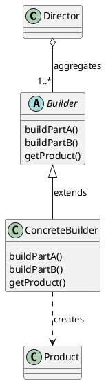
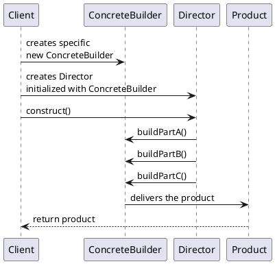

# Design Patterns

These are my notes for the Udemy course Python: SOLID Principles and
Top Design Patterns

## Intro

This course offers an in-depth exploration of seven essential software
design patterns. It covers Creational patterns (Singleton, Factory
Method, Builder), Structural patterns (Adapter), and Behavioral
patterns (Strategy, Observer, State).  The course combines pattern
explanations with hands-on Python implementation and culminates in a
simulation of Conway's Game of Life, demonstrating practical
applications of these patterns.

**Bullet List Summary**

* **Course Scope:** Focuses on seven foundational design patterns for
  better software development.
* **Pattern Families:**
   *  Creational: Simplify object creation.
   *  Structural:  Enhance object relationships and hierarchies.
   *  Behavioral: Streamline object communication.
* **Learning Structure:**
   *  Explanation of each pattern's architecture.
   *  Object-oriented Python implementation.
   *  Practical application in the Game of Life simulation.
* **Key Takeaway:** Mastery of these patterns leads to improved coding
  perspective and recognition of patterns in real-world software.

## Softare Architecture

Software architecture is crucial for building complex systems
effectively. It helps address common development challenges like
changing requirements, coordination overhead, code redundancy, and
maintainability issues. Here we explore the importance of software
architecture, highlighting the analogy of a skyscraper construction
blueprint. It introduces the development cycle (requirements, design,
implementation) and emphasizes the central role of design patterns in
facilitating well-structured software. This section also outlines
various project artifacts and explains the use of UML for documenting
design patterns.

* **Problems with poorly designed software:** extended timelines,
  coordination difficulties, redundancy, inadequate documentation,
  reduced maintainability, and limited flexibility.
* **Software architecture as a solution:** Provides a blueprint for
  software development, enhancing predictability and coherence.
* **Development cycle:** Involves requirements gathering, design
  (architecture), and implementation phases.
* **Iterative development:** Design and implementation can occur in
  smaller cycles, building upon a core system.
* **Project artifacts:** Include requirement documents, design
  documents, UI/UX specifications, test suites, deployment
  instructions, audit logs, analytics, and source code.
* **Design patterns and architecture:** Design patterns streamline the
  creation of good software architecture.
* **UML:** Used to document and communicate design patterns visually.

## About UML

This text explains the value of using UML (Unified Modeling Language)
diagrams to represent design patterns. Design patterns have
well-defined structures that UML effectively communicates
visually. For this course, the focus will be on class diagrams (for
structure) and sequence diagrams (for object interactions).  UML helps
isolate and study individual patterns, promoting a focused learning
approach.

**Bullet List Summary**

* **UML for Design Patterns:** UML is a suitable tool for documenting
  the structure and interactions within design patterns.
* **Types of UML Diagrams:**
   *  Class Diagrams: Show the relationships and hierarchy of classes
      within a pattern.
   *  Sequence Diagrams: Illustrate how objects communicate and
      collaborate to execute a pattern.
* **Benefits of UML for Learning:**
   *  Visual clarity for understanding pattern structure and behavior.
   *  Promotes studying patterns in isolation, aiding comprehension.
* **Divide and Conquer:** UML's ability to represent individual
  patterns supports a focused, step-by-step learning process.

### Example Class Diagram in PlantUML
   

   
This PlantUML code snippet represents a class diagram for a basic Builder design pattern, reflecting the relationships and elements you described:  
   
- The `Director` class aggregates one or more `Builder` instances, indicated by the "1..*" multiplicity.  
- The `Builder` class is marked as abstract, showcasing that it's meant to be a base class for more specific builders (like `ConcreteBuilder`).  
- The `ConcreteBuilder` class, which extends the `Builder` class, is capable of creating a `Product`.  
- The relationship between `ConcreteBuilder` and `Product` is marked with a dotted line to indicate the creation process.  
   
This diagram captures the essence of the Builder design pattern, where
the `Director` controls the construction process, the `Builder`
provides an abstract interface for creating parts of a `Product`, and
the `ConcreteBuilder` implements these steps to return the final
product.

## Example Sequence Diagram in PlantUML

To create a sequence diagram that captures the interaction flow, we
can use PlantUML to visualize the steps. Here's how the sequence
diagram can be represented in PlantUML code, based on your
description:
   

   
This PlantUML sequence diagram outlines the following interactions:
   
1. The **Client** creates a new instance of **ConcreteBuilder**.  
2. The **Client** then creates a **Director**, initializing it with the **ConcreteBuilder**.  
3. The **Client** calls the **construct()** method on the **Director**.  
4. The **Director**, coordinating the construction process, communicates with the **ConcreteBuilder** to build different parts of the product (Part A, Part B, Part C).  
5. Finally, the **ConcreteBuilder** delivers the constructed **Product** back to the **Client**.  
   
This diagram visually represents the flow of information and
interaction between the objects involved in the Builder design
pattern, highlighting the role of the Director in coordinating the
construction process and the ConcreteBuilder in creating specific
parts of the final product.
