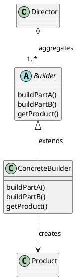
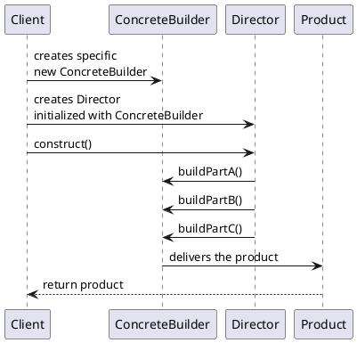
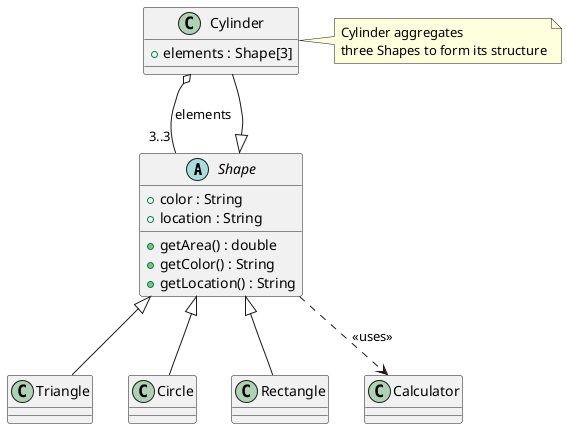
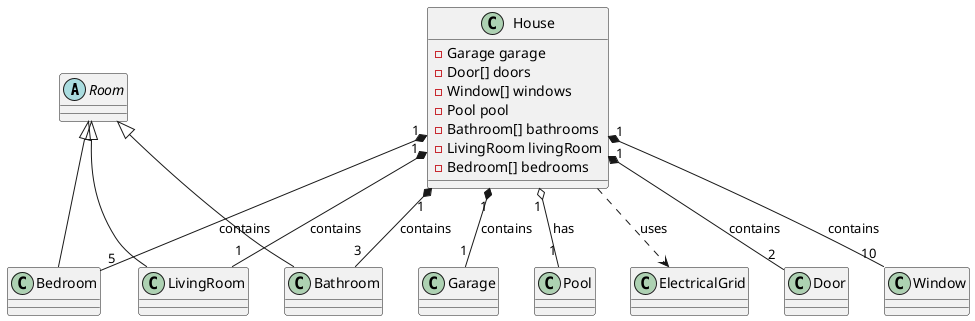
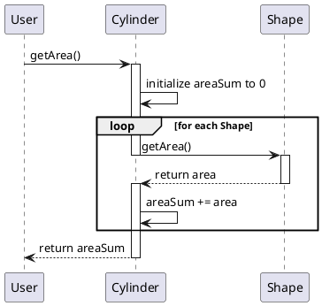
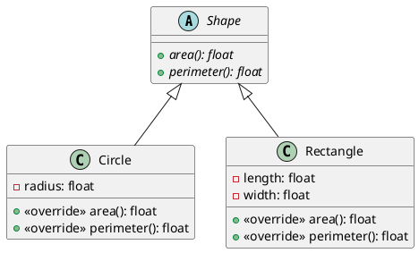

# Design Patterns

These are my notes for the Udemy course Python: SOLID Principles and
Top Design Patterns

## Intro

This course offers an in-depth exploration of seven essential software
design patterns. It covers Creational patterns (Singleton, Factory
Method, Builder), Structural patterns (Adapter), and Behavioral
patterns (Strategy, Observer, State).  The course combines pattern
explanations with hands-on Python implementation and culminates in a
simulation of Conway's Game of Life, demonstrating practical
applications of these patterns.

**Bullet List Summary**

* **Course Scope:** Focuses on seven foundational design patterns for
  better software development.
* **Pattern Families:**
   *  Creational: Simplify object creation.
   *  Structural:  Enhance object relationships and hierarchies.
   *  Behavioral: Streamline object communication.
* **Learning Structure:**
   *  Explanation of each pattern's architecture.
   *  Object-oriented Python implementation.
   *  Practical application in the Game of Life simulation.
* **Key Takeaway:** Mastery of these patterns leads to improved coding
  perspective and recognition of patterns in real-world software.


## Softare Architecture

Software architecture is crucial for building complex systems
effectively. It helps address common development challenges like
changing requirements, coordination overhead, code redundancy, and
maintainability issues. Here we explore the importance of software
architecture, highlighting the analogy of a skyscraper construction
blueprint. It introduces the development cycle (requirements, design,
implementation) and emphasizes the central role of design patterns in
facilitating well-structured software. This section also outlines
various project artifacts and explains the use of UML for documenting
design patterns.


* **Problems with poorly designed software:** extended timelines,
  coordination difficulties, redundancy, inadequate documentation,
  reduced maintainability, and limited flexibility.
* **Software architecture as a solution:** Provides a blueprint for
  software development, enhancing predictability and coherence.
* **Development cycle:** Involves requirements gathering, design
  (architecture), and implementation phases.
* **Iterative development:** Design and implementation can occur in
  smaller cycles, building upon a core system.
* **Project artifacts:** Include requirement documents, design
  documents, UI/UX specifications, test suites, deployment
  instructions, audit logs, analytics, and source code.
* **Design patterns and architecture:** Design patterns streamline the
  creation of good software architecture.
* **UML:** Used to document and communicate design patterns visually.

## About UML

This text explains the value of using UML (Unified Modeling Language)
diagrams to represent design patterns. Design patterns have
well-defined structures that UML effectively communicates
visually. For this course, the focus will be on class diagrams (for
structure) and sequence diagrams (for object interactions).  UML helps
isolate and study individual patterns, promoting a focused learning
approach.

**Bullet List Summary**

* **UML for Design Patterns:** UML is a suitable tool for documenting
  the structure and interactions within design patterns.
* **Types of UML Diagrams:**
   *  Class Diagrams: Show the relationships and hierarchy of classes
      within a pattern.
   *  Sequence Diagrams: Illustrate how objects communicate and
      collaborate to execute a pattern.
* **Benefits of UML for Learning:**
   *  Visual clarity for understanding pattern structure and behavior.
   *  Promotes studying patterns in isolation, aiding comprehension.
* **Divide and Conquer:** UML's ability to represent individual
  patterns supports a focused, step-by-step learning process.


### Example Class Diagram in PlantUML
   

   
This PlantUML code snippet represents a class diagram for a basic Builder design pattern, reflecting the relationships and elements you described:  
   
- The `Director` class aggregates one or more `Builder` instances, indicated by the "1..*" multiplicity.  
- The `Builder` class is marked as abstract, showcasing that it's meant to be a base class for more specific builders (like `ConcreteBuilder`).  
- The `ConcreteBuilder` class, which extends the `Builder` class, is capable of creating a `Product`.  
- The relationship between `ConcreteBuilder` and `Product` is marked with a dotted line to indicate the creation process.  
   
This diagram captures the essence of the Builder design pattern, where
the `Director` controls the construction process, the `Builder`
provides an abstract interface for creating parts of a `Product`, and
the `ConcreteBuilder` implements these steps to return the final
product.

### Example Sequence Diagram in PlantUML

To create a sequence diagram that captures the interaction flow, we
can use PlantUML to visualize the steps. Here's how the sequence
diagram can be represented in PlantUML code, based on your
description:
   

   
This PlantUML sequence diagram outlines the following interactions:
   
1. The **Client** creates a new instance of **ConcreteBuilder**.  
2. The **Client** then creates a **Director**, initializing it with the **ConcreteBuilder**.  
3. The **Client** calls the **construct()** method on the **Director**.  
4. The **Director**, coordinating the construction process, communicates with the **ConcreteBuilder** to build different parts of the product (Part A, Part B, Part C).  
5. Finally, the **ConcreteBuilder** delivers the constructed **Product** back to the **Client**.  
   
This diagram visually represents the flow of information and
interaction between the objects involved in the Builder design
pattern, highlighting the role of the Director in coordinating the
construction process and the ConcreteBuilder in creating specific
parts of the final product.


## Structured vs. Unstructured Code

This section explores the differences between structured and
unstructured code through visual representations.  The benefits of
organized code are discussed, including improved readability,
maintainability, and communication between code components. The goal
is to help developers create well-defined coding patterns.

* **Organized code:** Simpler patterns, easier to understand.
* **Unorganized code:** Overlapping components create complexity.
* **Structured code promotes:** Efficient communication within the codebase. 
* **Organized code facilitates:**  Clear patterns and relationships.
* **This course emphasizes:**  Best practices for structured, organized coding. 
* **Optional UML lecture:** Refresher for those interested. 

## Preparing Visual Studio Code for Python

This section provides a step-by-step guide on configuring Visual
Studio Code for Python development. It covers installing the Python
extension, creating a virtual environment (venv), and using the
package manager (pip). The emphasis is on setting up a structured
environment for running the course's coding examples.

**Bullet List Summary**

* **Assumptions:** Python (>= 3.7) and Visual Studio Code are already
  installed.
* **Python Extension:** Install the Microsoft Python extension for VS
  Code.
* **Virtual Environments (venv):** Create project-specific
  environments to manage dependencies.
```
python -m venv stage/project01/venv
```
* **Package Management (pip):** Use pip to install required Python
  libraries.
* **Object-Oriented Focus:** The course primarily uses object-oriented
  Python concepts
* **Environment Setup Demo:** The video demonstrates the configuration
  process.
  - Open Terminal in VSCode and run `python -m venv ./venv`
  - Then run `pip install numpy` in that environment

## UML for Structure and Behavior

This section provides a refresher on Unified Modeling Language (UML),
focusing on class diagrams and sequence diagrams. Class diagrams
visualize the structural relationships between objects, while sequence
diagrams illustrate how objects interact with each other over
time. These tools help understand both the composition and the
behavior of design patterns.

* **UML Purpose:** Visualizing object-oriented design structure and
  behaviors.
* **Class Diagrams:**
    * Capture class attributes, operations (methods), and visibility.
    * Model relationships like generalization (inheritance),
      association, and aggregation.
    * Show dependencies between classes.
* **Sequence Diagrams:**
    * Show how objects interact through message exchanges.
    * Demonstrate the flow of logic and method calls within a system.

### PlantUML class diagram of Shapes

The PlantUML representation will include the abstract class `Shape`
with its attributes and operations, the classes that inherit from
`Shape` (`Triangle`, `Circle`, `Rectangle`), and a `Cylinder` class
that is an example of aggregation. Additionally, I'll depict a package
to group these classes and a `Calculator` class to show a dependency
relationship with `Shape`.
   

   
This PlantUML script captures the core elements and relationships you described:  
   
- The abstract class `Shape` with its attributes (`color`, `location`) and operations (`getArea()`, `getColor()`, `getLocation()`), all marked as public (`+`).  
- The inheritance (generalization) relationship where `Triangle`, `Circle`, and `Rectangle` inherit from `Shape`.  
- The `Cylinder` class as an example of aggregation, containing a fixed-size array of `Shape` objects (`elements`).  
- The `Calculator` class showing a dependency relationship with `Shape`, indicating that `Shape` uses `Calculator`.  
- A package named "ShapesPackage" encapsulates all the classes, emphasizing their logical grouping.  
   
Remember, the actual visualization of this diagram requires a PlantUML
environment or compatible tool to parse and render the diagram from
the script provided.


### PlantUML class diagram of a house

Here is a description of a house as a PlantUML class diagram:
   

   
This diagram includes:  
- The interface `Room` and an abstract class also named `Room`, but in
  an actual implementation, they should not have the exact same
  name. This is just based on your description. Normally, you would
  name them differently to avoid confusion.
- Generalizations of the abstract class `Room` into `Bathroom`,
  `LivingRoom`, and `Bedroom`.
- A `House` class that has various associations with other classes,
  including a composition relationship (black diamond) with
  `Bathroom`, `LivingRoom`, `Bedroom`, `Door`, `Window`, and
  `Garage`. It also has an aggregation relationship (white diamond)
  with `Pool`, indicating the pool can exist independently of the
  `House`.
- A dependency relationship from `House` to `ElectricalGrid`,
  indicating that the house uses the electrical grid but does not own
  it.
   
### Visualizing Cylinder Area Calculation with PlantUML
   
PlantUML excels in illustrating complex interactions within
object-oriented systems. A compelling example of this is modeling the
process of calculating a cylinder's area, involving interactions among
a `User`, a `Cylinder`, and various `Shape` objects.
   
The sequence diagram below, created in PlantUML, outlines the
methodology for computing the area. It starts with a user's request
and progresses through the cylinder's internal operations,
highlighting the control flow between the cylinder and its shapes.
   

   
This diagram concisely demonstrates:  
   
- The initial request from the `User` to the `Cylinder` to calculate
  the area.
- The `Cylinder` iterating over its contained `Shape` objects,
  requesting each one's area.
- The temporary deactivation of the `Cylinder` while each `Shape`
  calculates its area, showcasing the shift in control.
- The aggregation of each `Shape`'s area into a total `areaSum`, which
  is eventually returned to the `User`.
   
Through this visualization, PlantUML provides a clear depiction of the
sequence and control flow in the area calculation process, making it
an invaluable tool for understanding and documenting system behaviors.

## Python and Object-Oriented Programming: A Refresher

This section provides a review of core object-oriented programming
(OOP) concepts in Python. Topics include classes and objects,
encapsulation, inheritance (including interfaces and abstract
classes). The section also offers a look at how these concepts are
represented in UML diagrams.

* **Classes and Objects:** Classes act as blueprints for creating
  objects that hold data and operations (methods).
* **Encapsulation:** Classes bundle data and corresponding methods,
  promoting organization and managing complexity.
* **Inheritance:** Enables creating new classes (derived classes) that
  inherit properties and behaviors from a base class, promoting code
  reusability.
* **Interface Contracts and Abstract Classes:** Essential tools for
  defining expected behaviors and enforcing design structure.
* **UML in Python OOP:** Visualizing class relationships and
  interactions with UML diagrams aids in understanding code.


### Abstract Interface in Python

To showcase the use of an abstract interface in Python, let's create a
simple example with an abstract class `Shape` that defines an
interface for methods `area()` and `perimeter()`. Then, we'll
implement this interface in concrete classes `Circle` and `Rectangle`.
   
#### Python Example Code
   
```python  
from abc import ABC, abstractmethod  
from math import pi  
   
class Shape(ABC):  
    @abstractmethod  
    def area(self):  
        pass  
  
    @abstractmethod  
    def perimeter(self):  
        pass  
   
class Circle(Shape):  
    def __init__(self, radius):  
        self.radius = radius  
  
    def area(self):  
        return pi * (self.radius ** 2)  
  
    def perimeter(self):  
        return 2 * pi * self.radius  
   
class Rectangle(Shape):  
    def __init__(self, length, width):  
        self.length = length  
        self.width = width  
  
    def area(self):  
        return self.length * self.width  
  
    def perimeter(self):  
        return 2 * (self.length + self.width)  
   
# Example usage  
circle = Circle(5)  
rectangle = Rectangle(10, 5)  
   
print(f"Circle Area: {circle.area()}")  
print(f"Circle Perimeter: {circle.perimeter()}")  
print(f"Rectangle Area: {rectangle.area()}")  
print(f"Rectangle Perimeter: {rectangle.perimeter()}")  
```  


   
#### Corresponding Class Diagram in PlantUML  
   
   

   
This PlantUML code represents an abstract class `Shape` with abstract
methods `area()` and `perimeter()`. Concrete classes `Circle` and
`Rectangle` inherit from `Shape` and implement these methods. The
notation `<|--` signifies inheritance. The `-` before a class member
indicates it is private, and the `+` indicates it is public. The
`{abstract}` keyword is used to denote abstract methods within the
abstract class.


#### Using the Interface in Python code

To illustrate how to use the interface with type hints, we'll create a
function that accepts a `Shape` object and prints out its area and
perimeter, utilizing the Python type hinting system. This function,
`print_shape_info`, will demonstrate how to enforce that only objects
adhering to the `Shape` interface can be passed to it.
   
   
```python  
def print_shape_info(shape: Shape) -> None:  
    """Prints the area and perimeter of a shape."""  
    print(f"Area: {shape.area()}")  
    print(f"Perimeter: {shape.perimeter()}")  
   
# Example usage  
circle = Circle(5)  
rectangle = Rectangle(10, 5)  
   
print_shape_info(circle)  
print_shape_info(rectangle)  
```  

This example defines the `print_shape_info` function with a type hint
that explicitly requires an argument of type `Shape`. This enforces at
the code level that the function can only accept objects that are
instances of `Shape` or its subclasses, thereby utilizing the `Shape`
interface. The function then calls the `.area()` and `.perimeter()`
methods on the provided `shape` object, showcasing polymorphism.

By using type hints this way, developers can create more readable,
maintainable, and self-documenting code. It clarifies the intention of
the function and ensures that the correct type of object is passed to
it, catching potential errors early in the development process.
