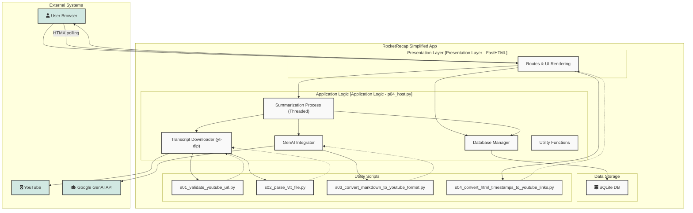
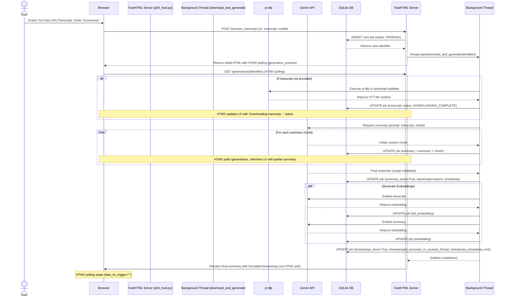
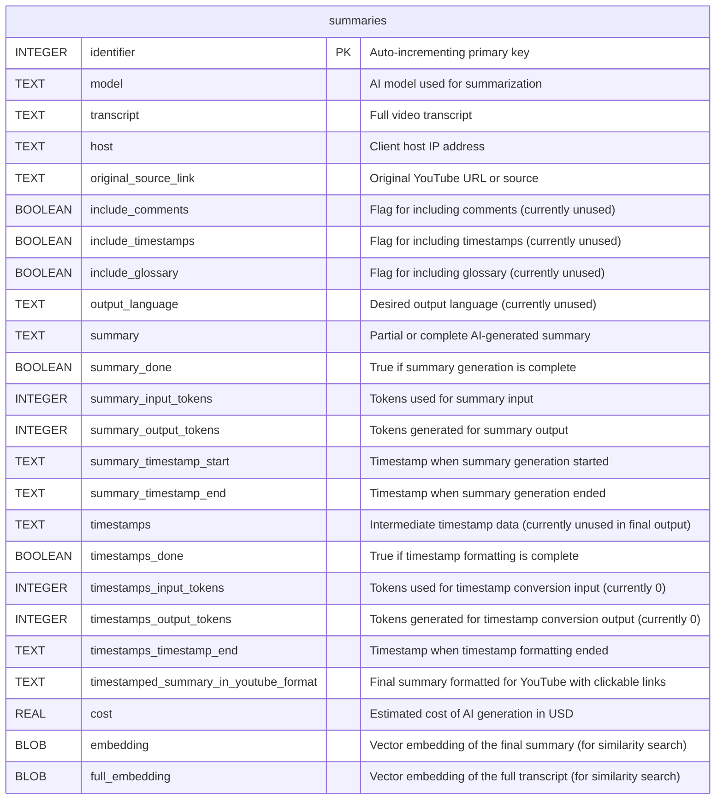
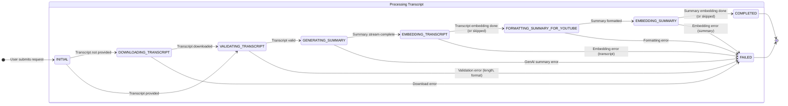

### 1. High-Level Architecture (Component Diagram)

This diagram illustrates the high-level architecture of the simplified RocketRecap application, highlighting its main components, external dependencies, and how they interact. The FastHTML framework serves as the presentation layer, handling user requests and rendering the UI. The core application logic in `p04_host.py` orchestrates the summarization process, utilizing external APIs for generative AI and transcript downloading, along with several utility scripts and a local SQLite database for persistence.

The user interacts with the FastHTML application, which initiates a background thread for summarization. This thread may download transcripts from YouTube, process them, call the Google Generative AI API for summary generation and embeddings, and store the results in the SQLite database. The UI is updated asynchronously via HTMX polling.

### 2. Asynchronous Summarization Flow (Sequence Diagram)

This sequence diagram details the asynchronous workflow for generating a video summary within the `p04_host.py` application. The user initiates the process via a web request, which immediately triggers a non-blocking background task. The client-side UI uses HTMX to poll the server for updates, receiving partial summaries and status changes as the background task progresses through transcript downloading, AI generation, and post-processing.

---

### 3. Database Schema (Entity Relationship Diagram)

This ERD visualizes the logical structure of the SQLite database used by `p04_host.py`. The application uses a single table, `summaries`, to store all information related to a summarization job. This table includes fields for the original source, the AI model used, the generated summary (both raw and YouTube-formatted), cost details, token usage, and vector embeddings for both the transcript and the summary. The `identifier` serves as the primary key.

---

### 4. Job Processing Lifecycle (State Diagram)

This state diagram models the lifecycle of a `summary` job as it progresses through various stages in the `p04_host.py` application. A job begins in the `INITIAL` state upon user submission and transitions through stages of transcript acquisition, AI summarization, and post-processing, including embedding generation and YouTube formatting. The process concludes in either a `COMPLETED` state upon successful execution or a `FAILED` state if an error occurs at any point.

### 5. API Routes and Endpoints

This section provides a detailed overview of all the HTTP routes supported by the `p04_host.py` application. These endpoints are designed to be consumed by an HTMX-powered front-end, handling everything from serving the main user interface to processing form submissions and providing real-time updates via polling.

| Endpoint | Method | Description | Request Data | Success Response |
| :--- | :--- | :--- | :--- | :--- |
| `/` | `GET` | Renders the main application page. This includes the submission form and a list of recently completed summaries fetched from the SQLite database. | - | Full HTML page (`text/html`). |
| `/process_transcript` | `POST` | The primary action endpoint that initiates a new summarization job. It creates a record in the `summaries` table, starts the `download_and_generate` function in a background thread, and returns an initial placeholder UI. | Form Data (`source_url`, `manual_transcript`, `model_id`). | **HTML Partial.** Returns a `
` containing the HTMX attributes needed to start polling the `/generations/{identifier}` endpoint for the newly created job. |
| `/generations/{id}` | `GET` | **HTMX Polling Endpoint.** Provides real-time progress updates for a specific job. It is polled every second by the client. The server checks the job's status in the database (`summary_done`, `timestamps_done`) and returns the appropriate HTML partial. | `id` (Path Parameter). | **HTML Partial.** Returns an "in-progress" view while the job is running. When complete, it returns the final formatted summary and includes an `HX-Trigger` header to stop the polling. |

