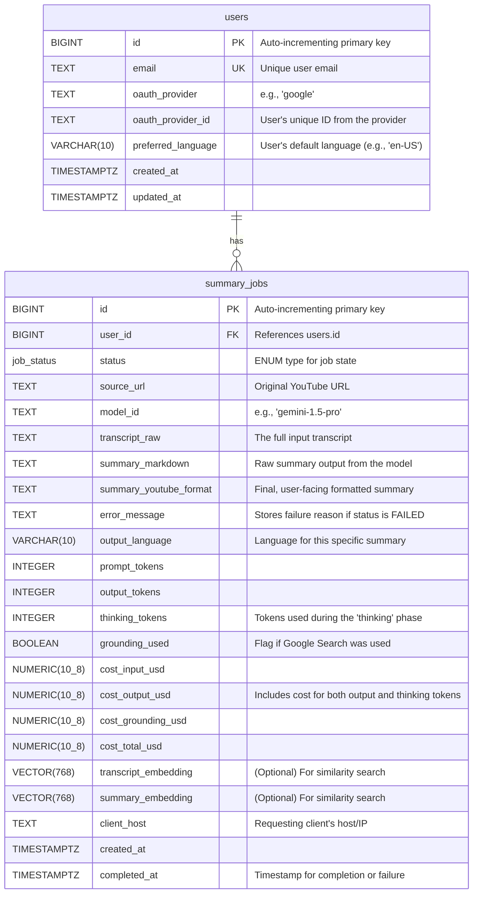

Excellent. Based on the architectural design and the new requirements, here is a formal proposal for the PostgreSQL database layout for RocketRecap v2.

---

## **Database Layout Proposal: RocketRecap v2**

### 1. Introduction

This document details the proposed PostgreSQL database schema for the second version of the RocketRecap application. The design moves away from the prototype's single SQLite table to a normalized, scalable structure that supports user authentication, detailed job tracking, multi-language outputs, and comprehensive cost management.

The primary goals of this schema are:
*   **Data Integrity:** Enforce relationships between users and their summarization jobs.
*   **Scalability:** Use appropriate data types and indexing for efficient querying in a multi-user environment.
*   **Feature Support:** Explicitly model new features like OAuth, "thinking" tokens, grounding costs, and job lifecycle states.
*   **Extensibility:** Provide a solid foundation for future features like similarity search via vector embeddings.

### 2. Schema Diagram

The core of the database consists of two main tables: `users` and `summary_jobs`, linked by a one-to-many relationship.



### 3. Table and Type Definitions

#### 3.1 Custom Type: `job_status`

To robustly manage the lifecycle of a summarization task, a custom `ENUM` type will be created. This is superior to the previous boolean flags (`summary_done`, `timestamps_done`) as it prevents invalid states and clearly defines the workflow.

```sql
CREATE TYPE job_status AS ENUM (
    'PENDING',
    'DOWNLOADING',
    'GENERATING',
    'COMPLETED',
    'FAILED'
);
```

#### 3.2 Table: `users`

This table stores information about authenticated users.

| Column Name         | Data Type     | Constraints & Notes                                           |
| ------------------- | ------------- | ------------------------------------------------------------- |
| `id`                | `BIGSERIAL`   | **Primary Key**. Auto-incrementing 64-bit integer.            |
| `email`             | `TEXT`        | **Unique**. User's email, used as the primary identifier.     |
| `oauth_provider`    | `TEXT`        | The name of the OAuth provider (e.g., 'google', 'github').    |
| `oauth_provider_id` | `TEXT`        | The unique ID for the user provided by the OAuth service.     |
| `preferred_language`| `VARCHAR(10)` | User's default language preference (e.g., 'en-US', 'de').     |
| `created_at`        | `TIMESTAMPTZ` | Timestamp of user creation. `DEFAULT now()`.                |
| `updated_at`        | `TIMESTAMPTZ` | Timestamp of the last update to the user record.              |

#### 3.3 Table: `summary_jobs`

This table is the evolution of the original `summaries` table, storing all data related to a single summarization request.

| Column Name                 | Data Type       | Constraints & Notes                                                              |
| --------------------------- | --------------- | -------------------------------------------------------------------------------- |
| `id`                        | `BIGSERIAL`     | **Primary Key**.                                                                 |
| `user_id`                   | `BIGINT`        | **Foreign Key** to `users.id`. Ensures job belongs to a user.                    |
| `status`                    | `job_status`    | **Not Null**. The current state of the job.                                      |
| `source_url`                | `TEXT`          | Original source link (e.g., YouTube URL).                                        |
| `model_id`                  | `TEXT`          | **Not Null**. The specific GenAI model used (e.g., 'gemini-1.5-flash-latest').   |
| `transcript_raw`            | `TEXT`          | The full transcript text used as input.                                          |
| `summary_markdown`          | `TEXT`          | The raw, unformatted Markdown summary from the AI.                               |
| `summary_youtube_format`    | `TEXT`          | The final summary after applying YouTube-specific formatting.                    |
| `error_message`             | `TEXT`          | Stores a descriptive error if `status` becomes `FAILED`.                         |
| `output_language`           | `VARCHAR(10)`   | The target language for the summary output for this specific job.                |
| `prompt_tokens`             | `INTEGER`       | Number of input tokens.                                                          |
| `output_tokens`             | `INTEGER`       | Number of generated content tokens.                                              |
| `thinking_tokens`           | `INTEGER`       | Number of tokens used during the model's "thinking" process.                     |
| `grounding_used`            | `BOOLEAN`       | **Not Null, DEFAULT false**. True if the request involved a grounding service.   |
| `cost_input_usd`            | `NUMERIC(10, 8)`| Calculated cost for input tokens. `NUMERIC` prevents floating point errors.    |
| `cost_output_usd`           | `NUMERIC(10, 8)`| Calculated cost for both output and thinking tokens combined.                    |
| `cost_grounding_usd`        | `NUMERIC(10, 8)`| Calculated cost for grounding (e.g., a Google Search call).                      |
| `cost_total_usd`            | `NUMERIC(10, 8)`| The sum of all cost components.                                                  |
| `transcript_embedding`      | `VECTOR(768)`   | **Requires `pgvector` extension**. Stores the transcript's vector embedding.     |
| `summary_embedding`         | `VECTOR(768)`   | **Requires `pgvector` extension**. Stores the summary's vector embedding.        |
| `client_host`               | `TEXT`          | The host/IP of the client who initiated the request (for analytics).             |
| `created_at`                | `TIMESTAMPTZ`   | Timestamp of job creation. `DEFAULT now()`.                                      |
| `completed_at`              | `TIMESTAMPTZ`   | Timestamp when the job finished (`COMPLETED` or `FAILED`).                         |

### 4. Design Rationale and Indexing Strategy

*   **Normalization:** Separating `users` from `summary_jobs` avoids data duplication and establishes a clear ownership model for each job, which is essential for a multi-user application.
*   **Detailed Cost Tracking:** Storing cost components (`input`, `output`, `grounding`) individually provides transparency and allows for detailed financial analytics. It also makes it possible to recalculate historical totals if pricing models change.
*   **Robust State Management:** The `job_status` ENUM provides a single, authoritative source for a job's state, simplifying application logic and preventing inconsistent states that were possible with multiple boolean flags.
*   **Data Type Selection:**
    *   `TIMESTAMPTZ` is used for all timestamps to ensure they are timezone-aware, which is critical for a global application.
    *   `NUMERIC` is the standard for financial data, guaranteeing precision.
    *   `VECTOR` (from the `pgvector` extension) is the industry standard for storing and efficiently querying high-dimensional embedding data within PostgreSQL.
*   **Indexing Strategy:** To ensure performant queries, the following indexes are recommended:
    *   An index on `summary_jobs(user_id, created_at DESC)` to quickly retrieve a user's recent jobs.
    *   An index on `summary_jobs(status)` to find all jobs in a specific state (e.g., all `PENDING` jobs for a worker process).
    *   A `UNIQUE` index on `users(email)`.
    *   The primary and foreign key constraints will be automatically indexed.

### 5. SQL Data Definition Language (DDL)

```sql
-- First, enable the pgvector extension if not already done
-- CREATE EXTENSION IF NOT EXISTS vector;

-- Define the custom ENUM type for job status
CREATE TYPE job_status AS ENUM (
    'PENDING',
    'DOWNLOADING',
    'GENERATING',
T    'COMPLETED',
    'FAILED'
);

-- Create the users table
CREATE TABLE users (
    id BIGSERIAL PRIMARY KEY,
    email TEXT NOT NULL UNIQUE,
    oauth_provider TEXT NOT NULL,
    oauth_provider_id TEXT NOT NULL,
    preferred_language VARCHAR(10),
    created_at TIMESTAMPTZ NOT NULL DEFAULT now(),
    updated_at TIMESTAMPTZ
);

-- Create the main summary_jobs table
CREATE TABLE summary_jobs (
    id BIGSERIAL PRIMARY KEY,
    user_id BIGINT NOT NULL REFERENCES users(id) ON DELETE CASCADE,
    status job_status NOT NULL DEFAULT 'PENDING',
    source_url TEXT,
    model_id TEXT NOT NULL,
    transcript_raw TEXT,
    summary_markdown TEXT,
    summary_youtube_format TEXT,
    error_message TEXT,
    output_language VARCHAR(10),
    prompt_tokens INTEGER,
    output_tokens INTEGER,
    thinking_tokens INTEGER,
    grounding_used BOOLEAN NOT NULL DEFAULT false,
    cost_input_usd NUMERIC(10, 8),
    cost_output_usd NUMERIC(10, 8),
    cost_grounding_usd NUMERIC(10, 8),
    cost_total_usd NUMERIC(10, 8),
    transcript_embedding VECTOR(768),
    summary_embedding VECTOR(768),
    client_host TEXT,
    created_at TIMESTAMPTZ NOT NULL DEFAULT now(),
    completed_at TIMESTAMPTZ
);

-- Create recommended indexes
CREATE INDEX idx_summary_jobs_user_id_created_at ON summary_jobs(user_id, created_at DESC);
CREATE INDEX idx_summary_jobs_status ON summary_jobs(status);

```
