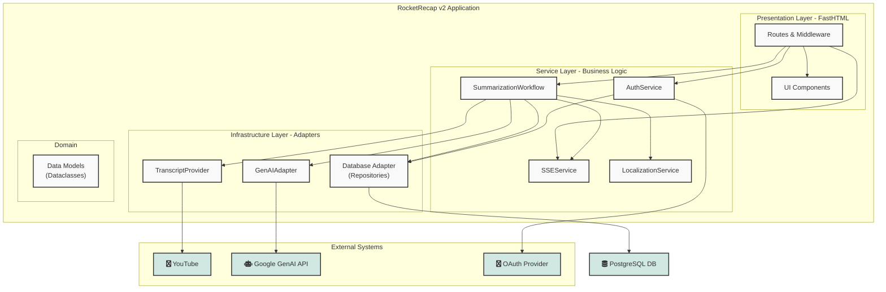

Of course. Here is the text section for the "High-Level Architecture" diagram, including a description and the Mermaid diagram code.

***

### 1. High-Level Architecture (Component Diagram)

This diagram provides a high-level overview of the major components of the RocketRecap v2 application, illustrating the layered architecture described in the design document. It shows the clear separation of concerns between handling user interactions (Presentation Layer), orchestrating business logic (Service Layer), and communicating with external systems (Infrastructure Layer). This structure enhances maintainability, testability, and scalability.

The flow begins with the user interacting with the Presentation Layer, which then delegates actions to the Service Layer. The Service Layer orchestrates complex workflows, such as summarization, by utilizing adapters in the Infrastructure Layer to communicate with external dependencies like the database and AI models.

