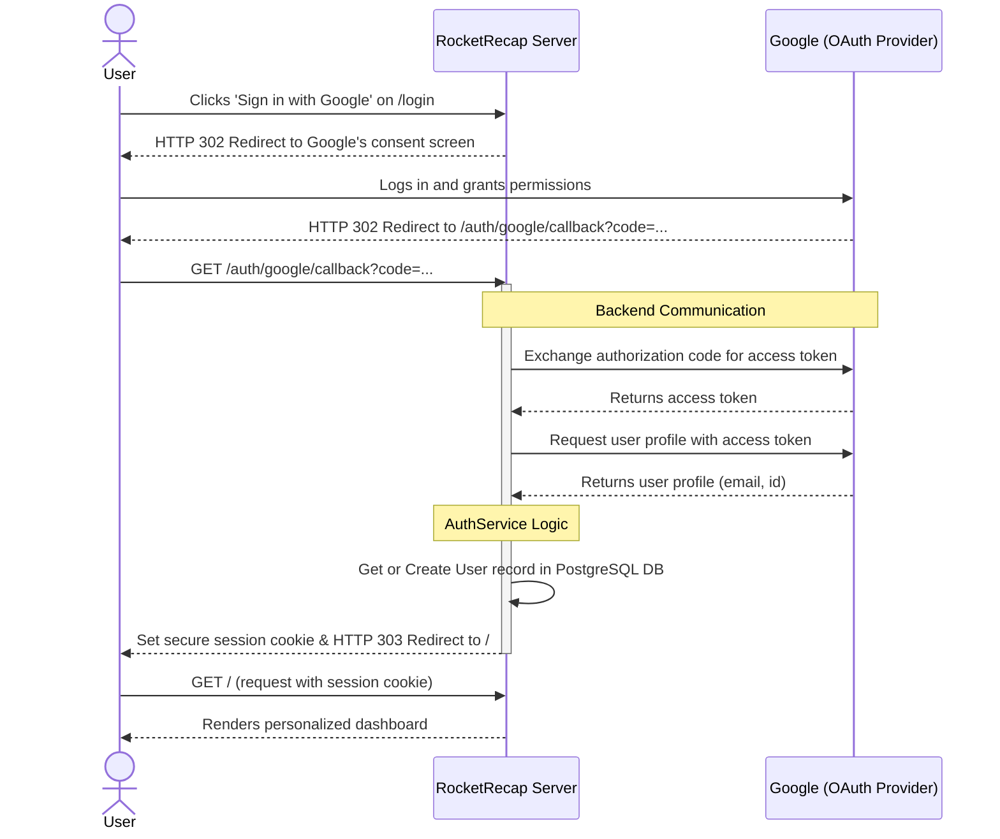

Of course. Here is the text section for the "User Authentication Flow," including a description and the corresponding Mermaid sequence diagram.

***

### 2. User Authentication Flow (Sequence Diagram)

A sequence diagram is the ideal tool to visualize the time-ordered interactions between different participants in a system. This diagram illustrates the standard OAuth 2.0 Authorization Code Grant flow, which is used to securely log a user into RocketRecap using their existing Google account.

The process involves a three-way communication between the user's browser, the RocketRecap server, and the Google OAuth provider. The key security aspect is that the user's Google credentials are never exposed to the RocketRecap application. Instead, a temporary authorization code is used to securely fetch the user's profile information after they have given consent.

