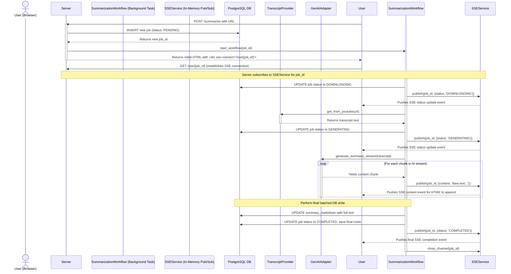

Of course. Here is the text section for the "Asynchronous Summarization Process," which details the most complex and dynamic workflow in the application.

***

### 3. Asynchronous Summarization Process (Sequence Diagram)

This diagram visualizes the end-to-end, asynchronous workflow for generating a video summary. A key architectural decision for RocketRecap v2 is to provide a non-blocking, real-time user experience. This is achieved by immediately responding to the user's request while initiating a long-running background task.

The client-side UI, powered by HTMX, establishes a Server-Sent Events (SSE) connection to receive live updates. The background workflow communicates its progress (e.g., "Downloading," "Generating") and streams the AI-generated summary back to the user as it's being created. This is all mediated by an in-memory Pub/Sub service (`SSEService`) to decouple the background task from the web request and to avoid overwhelming the database with constant small writes.

