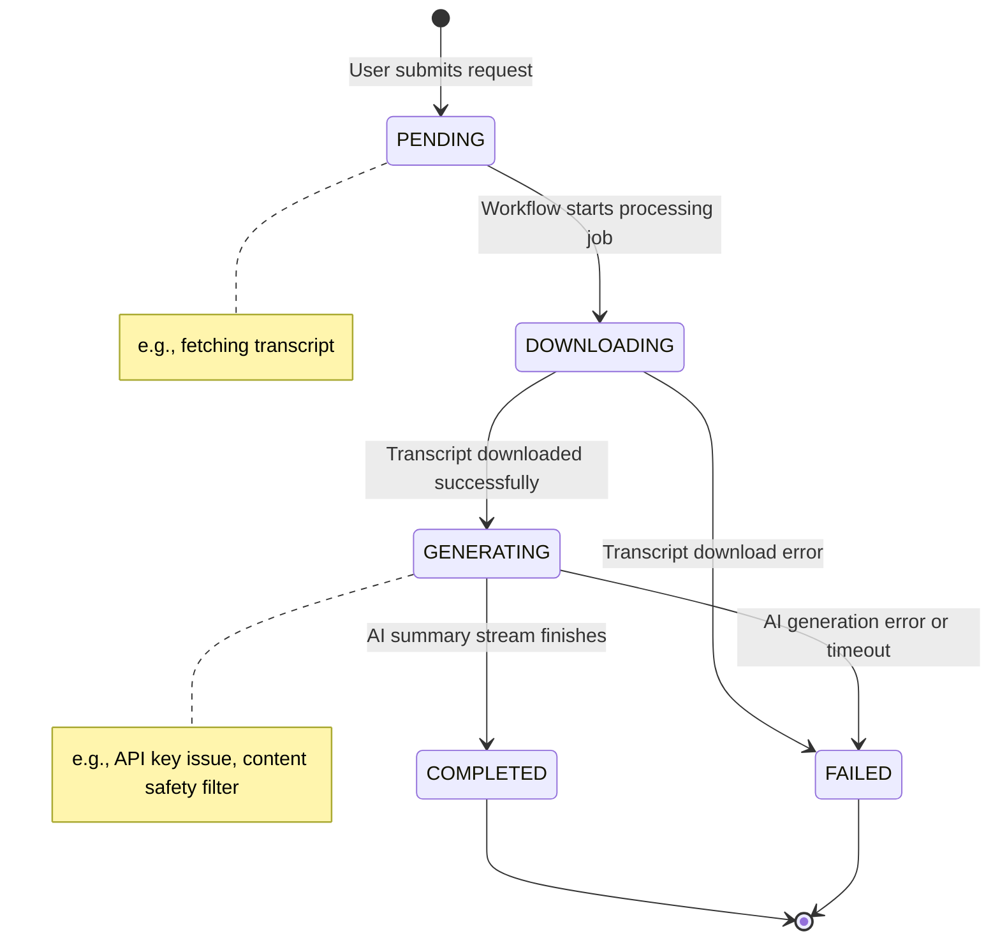

Of course. Here is the text section for the "Job Status Lifecycle," including the state diagram.

***

### 5. Job Status Lifecycle (State Diagram)

A state diagram is the perfect way to model the lifecycle of a single `summary_job`. It provides a clear and unambiguous representation of the possible states a job can be in and the specific events or conditions that cause it to transition from one state to another. This is a direct visualization of the custom `job_status` ENUM defined in the database schema.

The lifecycle begins when a user submits a request, creating a job in the `PENDING` state. From there, the background workflow drives the job through the `DOWNLOADING` and `GENERATING` states. The process concludes when the job reaches one of two terminal states: `COMPLETED` for a successful run or `FAILED` if an unrecoverable error occurs at any point during the process. This formal state machine simplifies the application logic, prevents invalid state combinations, and makes the workflow easier to debug and maintain.

