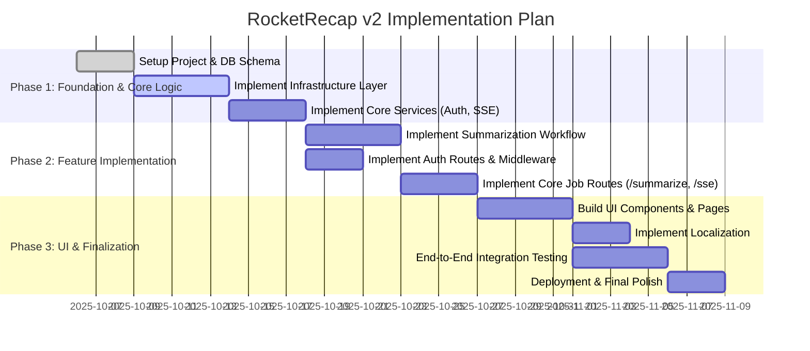

Of course. Here is the text section for the "Project Implementation Timeline," including a Gantt chart to visualize the plan.

***

### 6. Project Implementation Timeline (Gantt Chart)

A Gantt chart is a project management tool used to visualize the timeline of a project. It illustrates the start and finish dates of all the key tasks, shows the dependencies between them, and provides a clear overview of the project's entire scope from start to finish.

This chart breaks down the RocketRecap v2 refactoring process into three logical phases:
1.  **Foundation & Core Logic:** Setting up the project, database, and the essential infrastructure and service layers.
2.  **Feature Implementation:** Building the main application workflows, including user authentication and the asynchronous summarization process.
3.  **UI & Finalization:** Developing the user-facing components, integrating all features, and preparing for deployment.

This plan highlights critical dependencies—for example, the `SummarizationWorkflow` cannot be implemented until the underlying `Infrastructure Layer` is complete. This visualization helps in allocating resources and tracking progress against the project goals.

