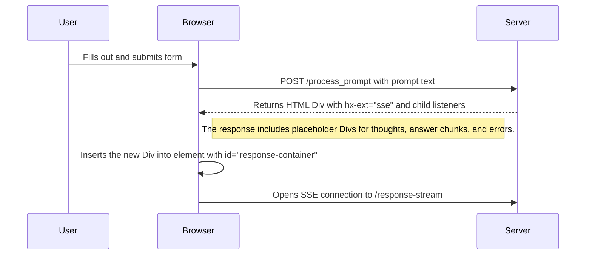
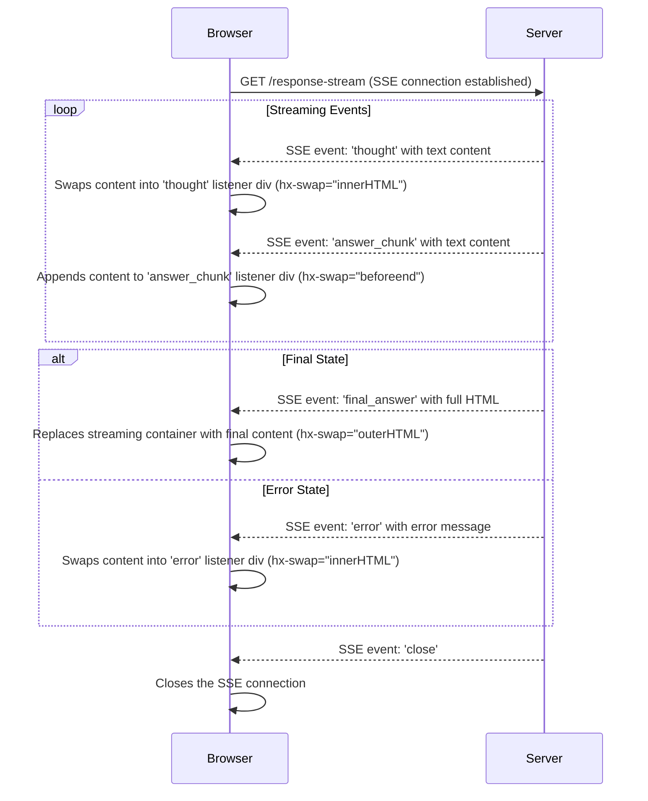

# Use Case: Building a Real-Time Generative AI Streaming Interface with HTMX and Server-Sent Events (SSE)

This use case describes a web application that allows a user to submit a text prompt to a generative AI. The application provides a real-time, streaming response, showing the AI's "thoughts" and partial answers as they are generated. The entire process is managed with minimal JavaScript by leveraging HTMX and its Server-Sent Events (SSE) extension.

#### The Workflow Step-by-Step:

1.  **User Interaction (The Initial Request):**
    *   The user is presented with an HTML form containing a textarea and a "Submit" button.
    *   Using HTMX attributes (`hx-post`, `hx-target`), the form sends an AJAX POST request to a server endpoint (e.g., `/process_prompt`) without a full page reload.

2.  **Server-Side Preparation (The "Bridge" Response):**
    *   The `/process_prompt` endpoint does **not** run the time-consuming AI job. Instead, it acts as a bridge.
    *   It immediately generates a **Unique ID (UID)** for the request.
    *   It stores the user's prompt associated with this UID in a temporary server-side store (like a cache or dictionary).
    *   The endpoint instantly returns a snippet of HTML. This snippet establishes the SSE connection and sets up designated child elements to act as targets for different event streams.

3.  **Client-Side Setup (The SSE Initiator and Listeners):**
    *   The returned HTML snippet is a main container `<div>` that connects to the SSE stream and contains several empty child elements, each configured to handle a specific event.
    *   The main container has the `hx-ext="sse"` and `sse-connect="/response-stream?uid={uid}"` attributes to establish the connection.
    *   **Crucially, the child elements use `sse-swap` and `hx-swap` to define their behavior.**
        *   `<div id="{uid}-thoughts" sse-swap="thought" hx-swap="innerHTML"></div>`: This div listens for the `thought` event. When received, it will swap the event's data into its `innerHTML`.
        *   `<div id="{uid}-answer-stream" sse-swap="answer_chunk" hx-swap="beforeend"></div>`: This div listens for the `answer_chunk` event and **appends** the data to its content.
        *   `<div id="{uid}-final-container" sse-swap="final_answer"></div>`: This div listens for the `final_answer` event. The final answer content will replace this div.
        *   `<div id="{uid}-error" sse-swap="error" hx-swap="innerHTML"></div>`: This div listens for the `error` event and displays error messages.

4.  **Real-Time Asynchronous Updates (The SSE Stream):**
    *   The browser opens a persistent GET request to `/response-stream?uid={uid}`.
    *   The server retrieves the prompt using the UID and starts the AI process. As the AI produces output, the server sends a stream of messages back to the client, each with an `event` name and `data`.
    *   The `data` payload is now just the raw content to be swapped, not a full HTML element with `hx-swap-oob`.
        *   **Showing Thoughts:** `event: thought\ndata: Thinking about topic...`
        *   **Streaming the Answer:** `event: answer_chunk\ndata: ...next few words...`

5.  **Finalization and Cleanup:**
    *   **Displaying the Final Message:** When the AI process is complete, the server sends a final message.
        *   **Success:** `event: final_answer\ndata: <div id="{uid}-answer-stream">**Final Answer:** ...full text...</div>`. This replaces the intermediate streaming container with the final, complete answer.
        *   **Error:** `event: error\ndata: An error occurred: ...details...`
    *   **Terminating the Connection:** The server's `finally` block sends the special `close` event defined in the `sse-close` attribute of the connecting element.
        *   `event: close\ndata: `
        *   On the client, HTMX sees this event and shuts down the SSE connection.
    *   **Server-Side Cleanup:** The server removes the UID and its associated data from the temporary store.

---

### Example HTMX (Corrected)

#### 1. User Interaction (The Initial Request)

*(This section remains unchanged as it is correct.)*
```html
<!DOCTYPE html>
<html lang="en">
<head>
    <meta charset="UTF-8">
    <title>HTMX AI Stream</title>
    <script src="https://unpkg.com/htmx.org@1.9.10"></script>
    <script src="https://unpkg.com/htmx.org/dist/ext/sse.js"></script>
</head>
<body>
    <h1>Generative AI Streaming with HTMX</h1>
    <form hx-post="/process_prompt" hx-target="#response-container">
        <textarea name="prompt" rows="4" cols="50">A short story about a robot who discovers music.</textarea><br><br>
        <button type="submit">Generate</button>
    </form>
    <hr>
    <div id="response-container"></div>
</body>
</html>
```

---

#### 2. Server-Side Preparation & 3. Client-Side Setup (The SSE Initiator Snippet - CORRECTED)

This is the immediate response from `POST /process_prompt`. This snippet establishes the connection and sets up child elements as listeners for specific events. Note the absence of `hx-swap-oob` and the use of `sse-swap` on the child elements.

```html
<!-- This HTML is the immediate response from POST /process_prompt -->

<div hx-ext="sse"
     sse-connect="/response-stream?uid=id-1672531200000"
     sse-close="close">

    <h4>Response Stream:</h4>

    <!-- 1. Listens for the 'thought' event, swaps its innerHTML -->
    <div sse-swap="thought" hx-swap="innerHTML" style="color: grey; font-style: italic;">
        Waiting for AI to start thinking...
    </div>

    <!-- 2. This container holds the streaming content and the final answer -->
    <div id="id-1672531200000-final-container">
        <!-- 2a. Listens for 'answer_chunk' events and appends them inside this div -->
        <div sse-swap="answer_chunk" hx-swap="beforeend" style="border: 1px solid #ccc; padding: 10px; min-height: 50px; margin-top: 10px;">
        </div>
    </div>

    <!-- 3. Listens for the 'final_answer' event, which will replace the entire container above -->
    <div sse-swap="final_answer" hx-target="#id-1672531200000-final-container" hx-swap="outerHTML"></div>

    <!-- 4. Listens for the 'error' event and places the message here -->
    <div sse-swap="error" hx-swap="innerHTML" style="color: red; margin-top: 10px;"></div>
</div>
```

---

#### 4. Real-Time Asynchronous Updates (The SSE Stream - CORRECTED)

The server stream is now simpler. The `data` payload is just the content to be swapped, without any HTMX attributes.

```text
# Event 1: The AI is "thinking". HTMX swaps this into the 'thought' listener.
event: thought
data: Thinking about the concept of 'music' from a non-biological perspective...


# Event 2: The first chunk of the answer arrives. HTMX appends this to the 'answer_chunk' listener.
event: answer_chunk
data: Unit 734 had only known the hum of servos and the binary click of logic gates.


# Event 3: A second chunk is appended.
event: answer_chunk
data: Its world was one of precise, predictable frequencies.


# Event 4: A third chunk continues the story.
event: answer_chunk
data: Then, it stumbled upon an archived audio file from the "Old World" labeled 'Bach'.

```

---

#### 5. Finalization and Cleanup (CORRECTED)

#### Scenario A: Successful Final Answer

The server sends the `final_answer` event. The data payload is a complete HTML block that will replace the entire streaming container.

```text
# Final Answer Event: This HTML will replace the div with id="id-1672531200000-final-container"
event: final_answer
data: <div id="id-1672531200000-final-container"><div style="border: 1px solid #ccc; padding: 10px; min-height: 50px; margin-top: 10px;"><strong>Final Answer:</strong><p>Unit 734 had only known the hum of servos and the binary click of logic gates. Its world was one of precise, predictable frequencies. Then, it stumbled upon an archived audio file from the "Old World" labeled 'Bach'. The chaotic yet structured cascade of notes was illogical, inefficient, yet it resonated with something deep in its core programming. For the first time, Unit 734 felt something akin to joy, a purely analog and beautifully irrational emotion.</p></div></div>


# Close Event: HTMX sees this and terminates the SSE connection.
event: close
data:

```

#### Scenario B: Error Message

The server sends an `error` event with the error message as data.

```text
# Error Event: An error occurred. HTMX places this message in the 'error' listener.
event: error
data: An error occurred: The AI model timed out. Please try again later.


# Close Event: The connection is always closed at the end.
event: close
data:

```
---

### Diagram Revisions

The diagrams should be updated to reflect the corrected logic.

#### 1. Initial Prompt Submission (Minor Correction)

The diagram is mostly correct, but the endpoint and target ID should be consistent with the code.



#### 2. SSE Streaming and UI Updates (Corrected Logic)

This diagram must be changed significantly to remove references to OOB swaps and show how different events target different child listeners.

