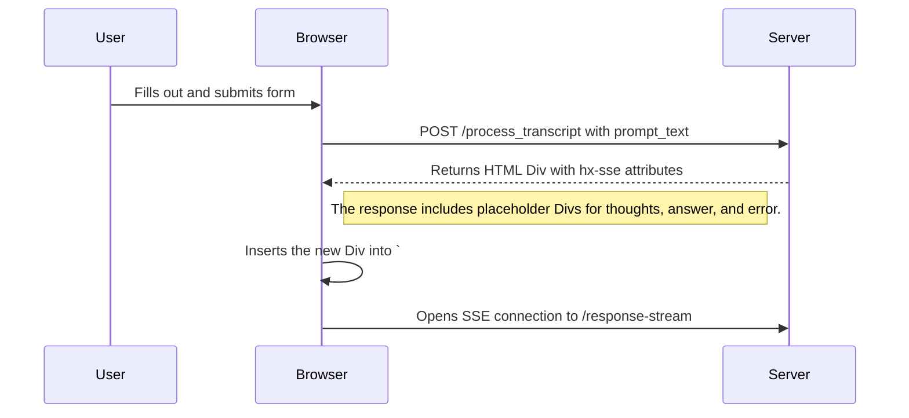
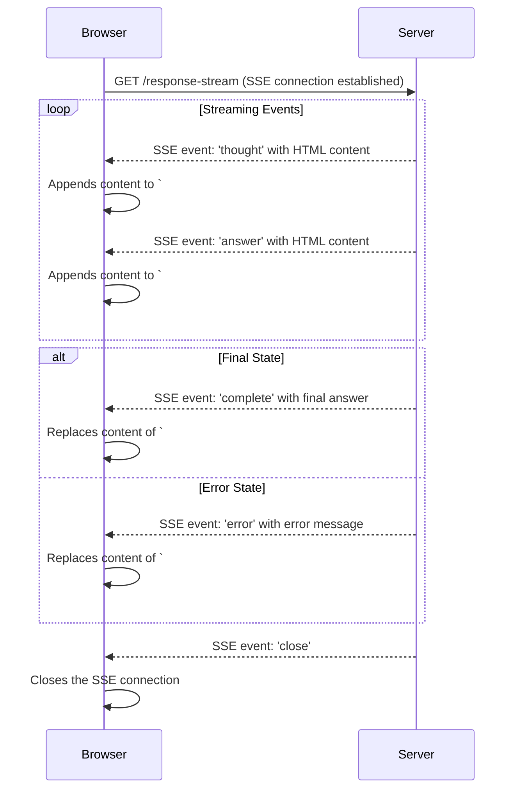

https://github.com/google/langextract this seems useful 


example error message when quota runs out:

```
INFO:     127.0.0.1:43460 - "GET /response-stream?prompt_text=tell%20me%20a%20joke HTTP/1.1" 200 OK
2025-10-09 22:55:42.640 UTC TRACE p01_top: GET response-stream prompt_text=tell me a joke
2025-10-09 22:55:42.640 UTC TRACE p01_top: created a genai configuration
2025-10-09 22:55:42.640 UTC TRACE p01_top: GenAIJob.__init__
2025-10-09 22:55:42.651 UTC TRACE p01_top: configured genai job
2025-10-09 22:55:42.651 UTC TRACE p01_top: GenAIJob._build_request
2025-10-09 22:55:42.651 UTC DEBUG p01_top: _build_request tell me a joke
2025-10-09 22:55:42.651 UTC DEBUG p01_top: Starting streaming generation
2025-10-09 22:55:42.900 UTC ERROR p01_top: genai 429 RESOURCE_EXHAUSTED. {'error': {'code': 429, 'message': 'You exceeded your current quota, please check your plan and billing details. For more information on this error, head to: https://ai.google.dev/gemini-api/docs/rate-limits.\n* Quota exceeded for metric: generativelanguage.googleapis.com/generate_content_free_tier_requests, limit: 10\nPlease retry in 17.156209832s.', 'status': 'RESOURCE_EXHAUSTED', 'details': [{'@type': 'type.googleapis.com/google.rpc.QuotaFailure', 'violations': [{'quotaMetric': 'generativelanguage.googleapis.com/generate_content_free_tier_requests', 'quotaId': 'GenerateRequestsPerMinutePerProjectPerModel-FreeTier', 'quotaDimensions': {'location': 'global', 'model': 'gemini-2.5-flash'}, 'quotaValue': '10'}]}, {'@type': 'type.googleapis.com/google.rpc.Help', 'links': [{'description': 'Learn more about Gemini API quotas', 'url': 'https://ai.google.dev/gemini-api/docs/rate-limits'}]}, {'@type': 'type.googleapis.com/google.rpc.RetryInfo', 'retryDelay': '17s'}]}}
2025-10-09 22:55:42.901 UTC TRACE p01_top: genai.job async for {'type': 'error', 'message': "429 RESOURCE_EXHAUSTED. {'error': {'code': 429, 'message': 'You exceeded your current quota, please check your plan and billing details. For more information on this error, head to: https://ai.google.dev/gemini-api/docs/rate-limits.\\n* Quota exceeded for metric: generativelanguage.googleapis.com/generate_content_free_tier_requests, limit: 10\\nPlease retry in 17.156209832s.', 'status': 'RESOURCE_EXHAUSTED', 'details': [{'@type': 'type.googleapis.com/google.rpc.QuotaFailure', 'violations': [{'quotaMetric': 'generativelanguage.googleapis.com/generate_content_free_tier_requests', 'quotaId': 'GenerateRequestsPerMinutePerProjectPerModel-FreeTier', 'quotaDimensions': {'location': 'global', 'model': 'gemini-2.5-flash'}, 'quotaValue': '10'}]}, {'@type': 'type.googleapis.com/google.rpc.Help', 'links': [{'description': 'Learn more about Gemini API quotas', 'url': 'https://ai.google.dev/gemini-api/docs/rate-limits'}]}, {'@type': 'type.googleapis.com/google.rpc.RetryInfo', 'retryDelay': '17s'}]}}"}

```

### 1. Initial Prompt Submission

This diagram shows the sequence when a user submits the prompt form. The server responds by creating a new container in the `#response-list` div, which then initiates an SSE connection.



### 2. SSE Streaming and UI Updates

This diagram illustrates how the browser receives Server-Sent Events (SSE) and uses them to update different parts of the page in real-time using "Out of Band" (OOB) swaps.

