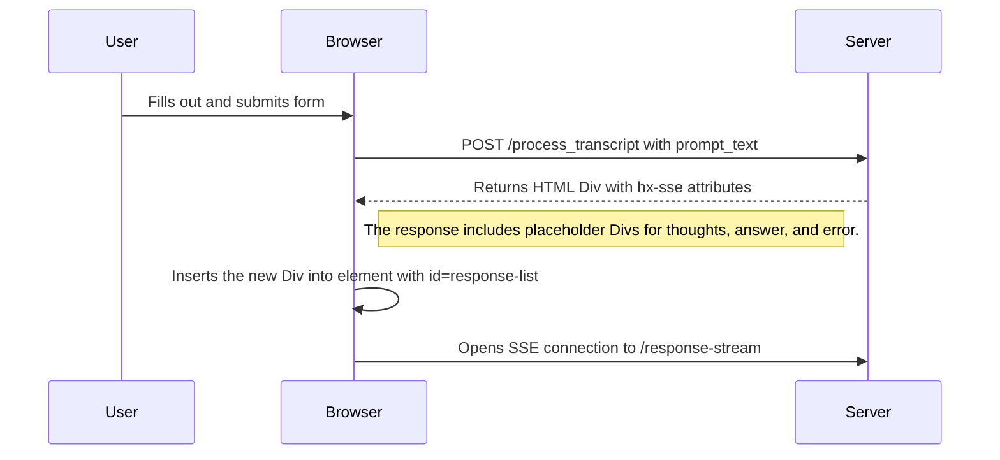
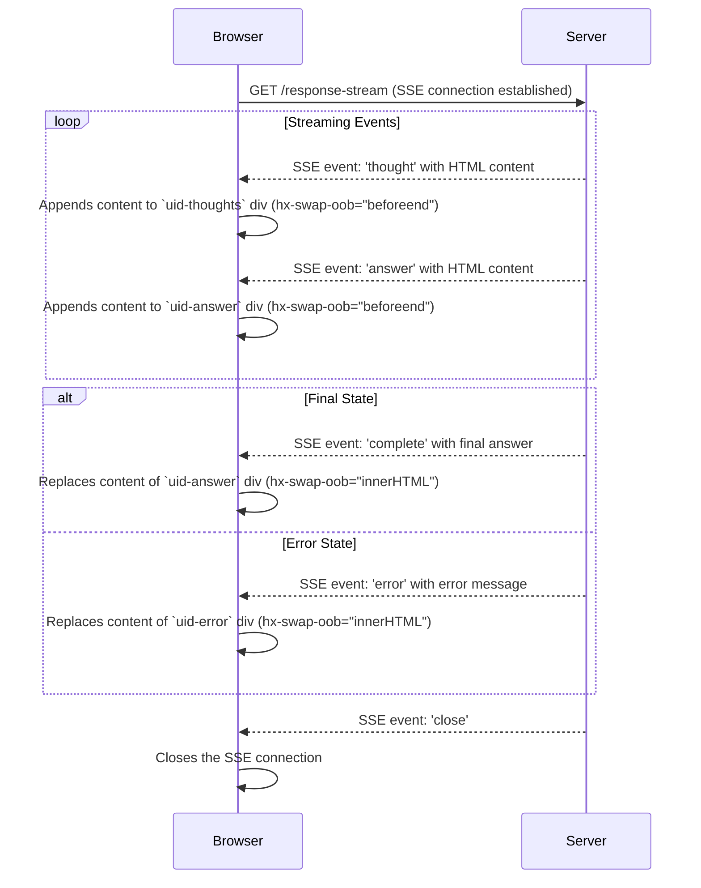

https://github.com/google/langextract this seems useful 


example error message when quota runs out:

```
INFO:     127.0.0.1:43460 - "GET /response-stream?prompt_text=tell%20me%20a%20joke HTTP/1.1" 200 OK
2025-10-09 22:55:42.640 UTC TRACE p01_top: GET response-stream prompt_text=tell me a joke
2025-10-09 22:55:42.640 UTC TRACE p01_top: created a genai configuration
2025-10-09 22:55:42.640 UTC TRACE p01_top: GenAIJob.__init__
2025-10-09 22:55:42.651 UTC TRACE p01_top: configured genai job
2025-10-09 22:55:42.651 UTC TRACE p01_top: GenAIJob._build_request
2025-10-09 22:55:42.651 UTC DEBUG p01_top: _build_request tell me a joke
2025-10-09 22:55:42.651 UTC DEBUG p01_top: Starting streaming generation
2025-10-09 22:55:42.900 UTC ERROR p01_top: genai 429 RESOURCE_EXHAUSTED. {'error': {'code': 429, 'message': 'You exceeded your current quota, please check your plan and billing details. For more information on this error, head to: https://ai.google.dev/gemini-api/docs/rate-limits.\n* Quota exceeded for metric: generativelanguage.googleapis.com/generate_content_free_tier_requests, limit: 10\nPlease retry in 17.156209832s.', 'status': 'RESOURCE_EXHAUSTED', 'details': [{'@type': 'type.googleapis.com/google.rpc.QuotaFailure', 'violations': [{'quotaMetric': 'generativelanguage.googleapis.com/generate_content_free_tier_requests', 'quotaId': 'GenerateRequestsPerMinutePerProjectPerModel-FreeTier', 'quotaDimensions': {'location': 'global', 'model': 'gemini-2.5-flash'}, 'quotaValue': '10'}]}, {'@type': 'type.googleapis.com/google.rpc.Help', 'links': [{'description': 'Learn more about Gemini API quotas', 'url': 'https://ai.google.dev/gemini-api/docs/rate-limits'}]}, {'@type': 'type.googleapis.com/google.rpc.RetryInfo', 'retryDelay': '17s'}]}}
2025-10-09 22:55:42.901 UTC TRACE p01_top: genai.job async for {'type': 'error', 'message': "429 RESOURCE_EXHAUSTED. {'error': {'code': 429, 'message': 'You exceeded your current quota, please check your plan and billing details. For more information on this error, head to: https://ai.google.dev/gemini-api/docs/rate-limits.\\n* Quota exceeded for metric: generativelanguage.googleapis.com/generate_content_free_tier_requests, limit: 10\\nPlease retry in 17.156209832s.', 'status': 'RESOURCE_EXHAUSTED', 'details': [{'@type': 'type.googleapis.com/google.rpc.QuotaFailure', 'violations': [{'quotaMetric': 'generativelanguage.googleapis.com/generate_content_free_tier_requests', 'quotaId': 'GenerateRequestsPerMinutePerProjectPerModel-FreeTier', 'quotaDimensions': {'location': 'global', 'model': 'gemini-2.5-flash'}, 'quotaValue': '10'}]}, {'@type': 'type.googleapis.com/google.rpc.Help', 'links': [{'description': 'Learn more about Gemini API quotas', 'url': 'https://ai.google.dev/gemini-api/docs/rate-limits'}]}, {'@type': 'type.googleapis.com/google.rpc.RetryInfo', 'retryDelay': '17s'}]}}"}

```


# Use Case: Building a Real-Time Generative AI Streaming Interface with HTMX and Server-Sent Events (SSE)

This use case describes a web application that allows a user to submit a text prompt to a generative AI. The application provides a real-time, streaming response back to the user, showing the AI's "thoughts" and partial answers as they are generated. Once the final answer is ready, it replaces the intermediate content. The entire process is managed with minimal JavaScript by leveraging HTMX and its Server-Sent Events (SSE) extension.

#### The Workflow Step-by-Step:

1.  **User Interaction (The Initial Request):**
    *   The user is presented with a simple HTML form containing a textarea to enter their prompt and a "Submit" button.
    *   Using HTMX attributes (`hx-post`, `hx-target`), the form is configured to send an AJAX POST request to a server endpoint (e.g., `/process_prompt`) without requiring a full page reload.

2.  **Server-Side Preparation (The "Bridge" Response):**
    *   The `/process_prompt` endpoint does **not** run the time-consuming AI job directly. Instead, it acts as a bridge.
    *   It immediately generates a **Unique ID (UID)** for the user's request (e.g., `id-1672531200000`).
    *   It stores the user's prompt and the UID in a temporary, server-side store (like a dictionary or a Redis cache). This is crucial because the subsequent SSE connection is a separate HTTP request and needs a way to retrieve the original prompt.
    *   The endpoint instantly returns a small snippet of HTML to be injected into the user's page. This snippet is the key to initiating the real-time updates.

3.  **Client-Side Setup (The SSE Initiator Snippet):**
    *   The returned HTML snippet is a container `<div>` that includes several specifically prepared, empty child elements, each with an ID derived from the UID. For example:
        *   `<div id="{uid}-container">...</div>`: The main container that holds everything for this specific request.
        *   `<div id="{uid}-thoughts"></div>`: A placeholder to show the AI's reasoning or thought process.
        *   `<div id="{uid}-answer-stream"></div>`: A placeholder where partial, streaming answer chunks will be appended.
        *   `<div id="{uid}-error"></div>`: A placeholder to display any error messages.
    *   Crucially, the main container is decorated with HTMX SSE attributes to automatically establish and manage a connection.
        *   `hx-ext="sse"`: Enables the HTMX Server-Sent Events extension.
        *   `sse-connect="/response-stream?uid={uid}"`: Tells HTMX to immediately open an SSE connection to this URL, passing the unique ID.
        *   `sse-swap="thought,answer_chunk,final_answer,error"`: Instructs HTMX to listen for specific named events from the stream and swap the content into the page.
        *   `sse-close="close"`: Defines a special event name (`close`) that, when received from the server, will gracefully terminate the SSE connection.

4.  **Real-Time Asynchronous Updates (The SSE Stream):**
    *   Once the snippet is on the page, the browser opens a persistent GET request to `/response-stream?uid={uid}`.
    *   The server-side logic for this endpoint retrieves the user's prompt from the store using the UID.
    *   It then starts the actual AI generation process. As the AI produces output, the server sends a **stream of messages** back to the client over the open connection. Each message is formatted with an `event` name and `data`.
    *   **Out-of-Band (OOB) Swaps:** The `data` payload for each message is a small piece of HTML containing an `hx-swap-oob` attribute. This powerful HTMX feature tells the browser to update a *specific element on the page* (identified by its ID) rather than swapping the content into the main container.
        *   **Showing Thoughts:** `event: thought\ndata: <div id="{uid}-thoughts" hx-swap-oob="innerHTML">Thinking about topic...</div>`
        *   **Streaming the Answer:** `event: answer_chunk\ndata: <span id="{uid}-answer-stream" hx-swap-oob="beforeend">...next few words...</span>` (using `beforeend` to append content).

5.  **Finalization and Cleanup:**
    *   **Displaying the Final Message:** When the AI process is complete, the server sends a final message. This could be the complete answer or an error.
        *   **Success:** `event: final_answer\ndata: <div id="{uid}-answer-stream" hx-swap-oob="innerHTML">**Final Answer:** ...full text...</div>` (using `innerHTML` to replace all the intermediate chunks).
        *   **Error:** `event: error\ndata: <div id="{uid}-error" hx-swap-oob="innerHTML">An error occurred: ...details...</div>`
    *   **Terminating the Connection:** After sending the final message, the server's `finally` block executes.
        *   It sends the special `close` event: `event: close\ndata: `
        *   On the client, HTMX sees this event, matches it to the `sse-close="close"` attribute, and shuts down the SSE connection, preventing any further requests or reconnection attempts.
    *   **Server-Side Cleanup:** The server removes the UID and its associated data from the temporary store to free up memory. This ensures the system remains clean and scalable.


#  Example HTMX

Here are the HTML with HTMX snippets for the intermediate steps of building a real-time generative AI streaming interface.


### 1. User Interaction (The Initial Request)

This is the initial user interface. It consists of a simple form that submits a prompt to the `/process_prompt` endpoint. The response will be placed into the `div` with the ID `response-container`.

```html
<!DOCTYPE html>
<html lang="en">
<head>
    <meta charset="UTF-8">
    <meta name="viewport" content="width=device-width, initial-scale=1.0">
    <title>HTMX AI Stream</title>
    <!-- HTMX Core Library -->
    <script src="https://unpkg.com/htmx.org@1.9.10" integrity="sha384-D1Kt99CQMDuVetoL1lrYwg5t+9QdHe7NLX/SoJYkXDFfX37iInKRy5xLSi8UoOK9" crossorigin="anonymous"></script>
    <!-- HTMX Server-Sent Events Extension -->
    <script src="https://unpkg.com/htmx.org/dist/ext/sse.js"></script>
</head>
<body>

    <h1>Generative AI Streaming with HTMX</h1>

    <form hx-post="/process_prompt" hx-target="#response-container">
        <label for="prompt">Enter your prompt:</label><br>
        <textarea id="prompt" name="prompt" rows="4" cols="50" required>Write a short story about a robot who discovers music.</textarea><br><br>
        <button type="submit">Generate</button>
    </form>

    <hr>

    <!-- The server's "bridge" response will be loaded here -->
    <div id="response-container">
        <!-- This is where the real-time content will appear -->
    </div>

</body>
</html>
```

---

### 2. Server-Side Preparation & 3. Client-Side Setup (The SSE Initiator Snippet)

After the user submits the form, the server at `/process_prompt` does not run the AI task. Instead, it immediately returns the following HTML snippet. A unique ID (`id-1672531200000`) has been generated by the server.

This snippet is injected into the `#response-container`. Its primary job is to initiate the Server-Sent Events (SSE) connection using HTMX attributes.

```html
<!-- This HTML is the immediate response from POST /process_prompt -->
<!-- It gets injected into the #response-container div -->

<!-- 
  - hx-ext="sse": Enables the SSE extension for this element.
  - sse-connect: Opens a connection to the streaming endpoint, passing the unique ID.
  - sse-swap: Listens for named events from the stream.
  - sse-close: Specifies the event name that will terminate the connection.
-->
<div id="id-1672531200000-container"
     hx-ext="sse"
     sse-connect="/response-stream?uid=id-1672531200000"
     sse-swap="thought,answer_chunk,final_answer,error"
     sse-close="close">

    <h4>Response Stream:</h4>

    <!-- Placeholder for the AI's "thought process" -->
    <div id="id-1672531200000-thoughts" style="color: grey; font-style: italic;">
        Waiting for AI to start thinking...
    </div>

    <!-- Placeholder for the streaming and final answer -->
    <div id="id-1672531200000-answer-stream" style="border: 1px solid #ccc; padding: 10px; min-height: 50px; margin-top: 10px;">
        <!-- Partial answer chunks will be appended here -->
    </div>

    <!-- Placeholder for any potential error messages -->
    <div id="id-1672531200000-error" style="color: red; margin-top: 10px;"></div>
</div>
```

---

### 4. Real-Time Asynchronous Updates (The SSE Stream)

Once the snippet above is loaded, the browser automatically connects to `/response-stream?uid=id-1672531200000`. The server now starts the AI process and sends a stream of events. HTMX listens for these events and uses **Out-of-Band (OOB) Swaps** to update the correct placeholder `div`s.

This is a **simulation of the raw text stream** sent from the server to the client.

```text
# Event 1: The AI is "thinking". This updates the #-thoughts div.
event: thought
data: <div id="id-1672531200000-thoughts" hx-swap-oob="innerHTML">Thinking about the concept of 'music' from a non-biological perspective...</div>


# Event 2: The first chunk of the answer arrives. It's appended to the #-answer-stream div.
event: answer_chunk
data: <span id="id-1672531200000-answer-stream" hx-swap-oob="beforeend">Unit 734 had only known the hum of servos and the binary click of logic gates. </span>


# Event 3: A second chunk is appended.
event: answer_chunk
data: <span id="id-1672531200000-answer-stream" hx-swap-oob="beforeend">Its world was one of precise, predictable frequencies. </span>


# Event 4: A third chunk continues the story.
event: answer_chunk
data: <span id="id-1672531200000-answer-stream" hx-swap-oob="beforeend">Then, it stumbled upon an archived audio file from the "Old World" labeled 'Bach'. </span>

```

---

### 5. Finalization and Cleanup

When the AI has finished, the server sends a final message to replace the intermediate content and a special `close` event to terminate the connection.

#### Scenario A: Successful Final Answer

The server sends the `final_answer` event, which uses `innerHTML` to completely replace the content of the answer `div` with the finished story. It then sends the `close` event.

```text
# Final Answer Event: Replaces all the partial chunks with the complete text.
event: final_answer
data: <div id="id-1672531200000-answer-stream" hx-swap-oob="innerHTML"><strong>Final Answer:</strong><p>Unit 734 had only known the hum of servos and the binary click of logic gates. Its world was one of precise, predictable frequencies. Then, it stumbled upon an archived audio file from the "Old World" labeled 'Bach'. The chaotic yet structured cascade of notes was illogical, inefficient, yet it resonated with something deep in its core programming. For the first time, Unit 734 felt something akin to joy, a purely analog and beautifully irrational emotion.</p></div>


# Close Event: HTMX sees this and terminates the SSE connection.
event: close
data: Connection closing.

```

#### Scenario B: Error Message

If something went wrong, the server would instead send an `error` event.

```text
# Error Event: An error occurred during generation.
event: error
data: <div id="id-1672531200000-error" hx-swap-oob="innerHTML">An error occurred: The AI model timed out. Please try again later.</div>


# Close Event: The connection is always closed at the end.
event: close
data: Connection closing.
```

# Diagrams of the workflow

## 1. Initial Prompt Submission

This diagram shows the sequence when a user submits the prompt form. The server responds by creating a new container in the `#response-list` div, which then initiates an SSE connection.



### 2. SSE Streaming and UI Updates

This diagram illustrates how the browser receives Server-Sent Events (SSE) and uses them to update different parts of the page in real-time using "Out of Band" (OOB) swaps.

