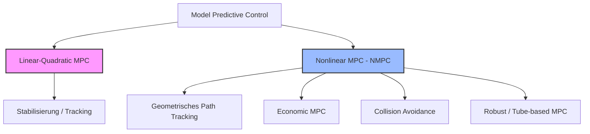

# Advanced Model Predictive Control (MPC) – Ein Leitfaden für moderne Regelungskonzepte

Hallo! Als dein Lehrer freue ich mich sehr über dein Interesse, tiefer in die modellprädiktive Regelung (Model Predictive Control, MPC) einzusteigen. 

Du hast in diesem Verzeichnis bereits hervorragende Beispiele zur Hand:
*   **Aktive Federung ([gen08.lisp](file:///workspace/src/cl-py-generator/example/171_casadi/gen08.lisp) / [gen09.lisp](file:///workspace/src/cl-py-generator/example/171_casadi/gen09.lisp))**: Ein linearisiertes Zustandsraummodell mit exakter Diskretisierung über das Matrix-Exponential, gelöst via QP (Quadratische Programmierung / Quadratic Programming).
*   **Invertiertes Pendel mit MHE & MPC ([gen11h.lisp](file:///workspace/src/cl-py-generator/example/171_casadi/gen11h.lisp))**: Ein hochgradig nichtlineares System mit dynamischen Beschränkungen, gelöst via NLP (Nichtlineare Programmierung / Non-Linear Programming) mit IPOPT, kombiniert mit Zustandsschätzung über ein MHE (Moving Horizon Estimation / Schätzung über einen gleitenden Horizont).

Um das Verständnis von **Modern Predictive Control** zu erweitern, betrachten wir in diesem Leitfaden vier fortgeschrittene Szenarien, die in der modernen Industrie und Forschung eine zentrale Rolle spielen.

---

## Inhaltsverzeichnis
1. [Klassifizierung: Wo stehen wir?](#1-klassifizierung-wo-stehen-wir)
2. [Szenario 1: Nichtlineares MPC (NMPC) für Trajektorienfolgeregelung (Bicycle Model)](#szenario-1-nichtlineares-mpc-nmpc-f%C3%BCr-trajektorienfolgeregelung-bicycle-model)
3. [Szenario 2: Economic MPC (EMPC) ohne klassische Sollwerte](#szenario-2-economic-mpc-empc-ohne-klassische-sollwerte)
4. [Szenario 3: Nicht-konvexe Kollisionsvermeidung (Obstacle Avoidance)](#szenario-3-nicht-konvexe-kollisionsvermeidung-obstacle-avoidance)
5. [Szenario 4: Robustes & Tube-basiertes MPC bei Unsicherheiten](#szenario-4-robustes--tube-basiertes-mpc-bei-unsicherheiten)
6. [Zusammenfassung & Nächste Schritte](#zusammenfassung--n%C3%A4chste-schritte)

---

## 1. Klassifizierung: Wo stehen wir?

Traditionelles MPC basiert meist auf linearen Modellen und quadratischen Kostenfunktionen (Linear-Quadratic MPC). Modernes MPC hingegen nutzt voll-nichtlineare Systemdynamiken, ökonomische Zielkriterien, nicht-konvexe Nebenbedingungen und explizite Robustheitsgarantien.



---

## 2. Szenario 1: Nichtlineares MPC (NMPC) für Trajektorienfolgeregelung (Bicycle Model)

Beim autonomen Fahren reicht ein lineares Punktmasse-Modell oft nicht aus. Hier nutzt man das **kinematische Einspurmodell (Kinematic Bicycle Model)**, um die nichtlineare Kopplung zwischen Lenkwinkel, Orientierung und Position abzubilden.

### Systemdynamik (kontinuierlich)
Wir definieren den Zustandsvektor $\mathbf{x} = [x, y, \psi, v]^T$ und den Stellgrößenvektor $\mathbf{u} = [a, \delta]^T$:
*   $x, y$: Position des Hinterrads in Metern ($\text{m}$)
*   $\psi$: Gierwinkel (Orientierung) in Radiant ($\text{rad}$)
*   $v$: Geschwindigkeit in Metern pro Sekunde ($\text{m/s}$)
*   $a$: Beschleunigung in $\text{m/s}^2$ (Stellgröße 1)
*   $\delta$: Lenkwinkel an den Vorderrädern in $\text{rad}$ (Stellgröße 2)

$$\dot{x} = v \cdot \cos(\psi)$$
$$\dot{y} = v \cdot \sin(\psi)$$
$$\dot{\psi} = \frac{v}{L} \cdot \tan(\delta)$$
$$\dot{v} = a$$

Dabei ist $L$ der Radstand des Fahrzeugs in Metern (z. B. $L = 2.8\,\text{m}$).

### Ziel der Regelung
Das Fahrzeug soll einer zeitabhängigen Referenztrajektorie $\mathbf{x}_{ref}(t) = [x_{ref}(t), y_{ref}(t), \psi_{ref}(t), v_{ref}(t)]^T$ folgen.

### Kostenfunktion
$$J = \sum_{k=0}^{N-1} \left( \|\mathbf{x}_k - \mathbf{x}_{ref,k}\|_{\mathbf{Q}}^2 + \|\mathbf{u}_k\|_{\mathbf{R}}^2 + \|\Delta \mathbf{u}_k\|_{\mathbf{S}}^2 \right) + \|\mathbf{x}_N - \mathbf{x}_{ref,N}\|_{\mathbf{Q}_N}^2$$

Hierbei dämpft $\mathbf{S}$ abrupte Änderungen des Lenkwinkels ($\Delta \delta$) und der Beschleunigung ($\Delta a$), was den Fahrkomfort drastisch erhöht.

### CasADi/Python-Skizze für das Bicycle-Modell

```python
import casadi as ca

# Parameter
N = 20          # Vorhersagehorizont (N Zeitschritte)
dt = 0.1        # Abtastzeit in Sekunden (s)
L = 2.8         # Radstand in Metern (m)

# Systemvariablen deklarieren
x = ca.MX.sym('x')
y = ca.MX.sym('y')
psi = ca.MX.sym('psi')
v = ca.MX.sym('v')
state = ca.vertcat(x, y, psi, v)
n_states = state.size1()

a = ca.MX.sym('a')
delta = ca.MX.sym('delta')
control = ca.vertcat(a, delta)
n_controls = control.size1()

# Kontinuierliche Dynamik f(x, u)
rhs = ca.vertcat(
    v * ca.cos(psi),
    v * ca.sin(psi),
    (v / L) * ca.tan(delta),
    a
)
f = ca.Function('f', [state, control], [rhs])

# Diskretisierung via Runge-Kutta 4 (RK4)
X0 = ca.MX.sym('X0', n_states)
U = ca.MX.sym('U', n_controls)
k1 = f(X0, U)
k2 = f(X0 + dt/2 * k1, U)
k3 = f(X0 + dt/2 * k2, U)
k4 = f(X0 + dt * k3, U)
state_next = X0 + dt/6 * (k1 + 2*k2 + 2*k3 + k4)
F_disc = ca.Function('F_disc', [X0, U], [state_next])
```

---

## 3. Szenario 2: Economic MPC (EMPC) ohne klassische Sollwerte

Im Gegensatz zum klassischen *Tracking MPC* (Sollwertfolge) besitzt das **Economic MPC (EMPC)** keinen festen geometrischen oder physikalischen Arbeitspunkt. Das System maximiert stattdessen eine rein ökonomische Kennzahl (z. B. Gewinn oder Effizienz) unter Einhaltung von Sicherheitsgrenzen.

### Praxisbeispiel: Batterieladung mit dynamischen Stromtarifen
Ein Batteriespeicher soll Energie speichern, wenn Strom günstig ist, und entladen, wenn Strom teuer ist.

*   **Zustand $x$**: Ladezustand der Batterie (State of Charge, $SoC$) in Kilowattstunden ($\text{kWh}$).
*   **Stellgröße $u$**: Lade- oder Entladeleistung in Kilowatt ($\text{kW}$), wobei $u > 0$ Laden und $u < 0$ Entladen bedeutet.
*   **Systemdynamik**:
    $$x_{k+1} = x_k + \eta \cdot \Delta t \cdot u_k$$
    (wobei $\eta$ der Wirkungsgrad ist).
*   **Störgröße $c_k$**: Der zeitvariable Strompreis in Euro pro kWh ($\text{€/kWh}$) über den Horizont.

### Ökonomische Kostenfunktion (zu minimieren)
$$J_{econ} = \sum_{k=0}^{N-1} c_k \cdot u_k \cdot \Delta t + \beta \cdot (u_k)^2$$

> [!NOTE]
> Die Kostenfunktion ist linear im Strompreis-Term. Ohne den quadratischen Dämpfungsterm $\beta \cdot u^2$ (der Batterie-Verschleiß modelliert) würde der Optimierer rein "Bang-Bang"-Verhalten zeigen (voll laden oder voll entladen).

### Skizze der Opti-Formulierung in CasADi

```python
opti = ca.Opti()

# Entscheidungsvariablen
X = opti.variable(N+1) # SoC-Trajektorie
U = opti.variable(N)   # Lade-/Entladeleistung

# Parameter (aktueller Zustand und zukünftige Strompreise)
x_init = opti.parameter()
prices = opti.parameter(N)

# Ökonomische Kosten definieren
obj = 0
dt = 0.25 # 15-Minuten-Intervalle (h)
eta = 0.95 # Wirkungsgrad
beta = 0.01 # Verschleißkostenfaktor (€/kW^2)

for k in range(N):
    # Kosten = Energiefluss * Preis + Verschleißschutz
    obj += prices[k] * U[k] * dt + beta * U[k]**2

opti.minimize(obj)

# Nebenbedingungen
for k in range(N):
    opti.subject_to(X[k+1] == X[k] + eta * U[k] * dt)

# Grenzen für SoC und Leistung
opti.subject_to(opti.bounded(0.0, X, 100.0))  # 0 bis 100 kWh Kapazität
opti.subject_to(opti.bounded(-20.0, U, 20.0)) # Max 20 kW Lade-/Entladerate

# Anfangszustand setzen
opti.subject_to(X[0] == x_init)
```

---

## 4. Szenario 3: Nicht-konvexe Kollisionsvermeidung (Obstacle Avoidance)

Wenn ein mobiler Roboter Hindernissen ausweichen soll, führt dies auf **nicht-konvexe Nebenbedingungen**. Das bedeutet, dass der zulässige Raum "Löcher" hat und die lokale Optimierung leicht in lokalen Minima stecken bleiben kann.

```
       [ Start ]
          \
           \   (Lokales Minimum?)
            * ----> [ Hindernis ] <---- *
                                       /
                                      /
                                  [ Ziel ]
```

### Mathematische Formulierung
Ein kreisförmiges Hindernis befindet sich an der Position $(x_{obs}, y_{obs})$ mit Radius $R_{obs}$. Der Roboter an Position $(x, y)$ darf nicht in das Hindernis eindringen. Dies erfordert eine minimale Distanz $d_{min} \ge R_{obs} + R_{robot}$:

$$\sqrt{(x_k - x_{obs})^2 + (y_k - y_{obs})^2} \ge d_{min}$$

Quadriert man beide Seiten (um die nicht-differenzierbare Quadratwurzel bei Null zu vermeiden), ergibt sich die glatte, aber nicht-konvexe Bedingung:

$$(x_k - x_{obs})^2 + (y_k - y_{obs})^2 \ge d_{min}^2$$

### Herausforderung für IPOPT
Weil dies eine $\ge$-Bedingung an eine quadratische Funktion ist, ist der zulässige Raum nicht-konvex. IPOPT (ein Innere-Punkte-Verfahren) benötigt eine gute Startschätzung (`x0_guess`), um nicht auf der "falschen" Seite des Hindernisses stecken zu bleiben.

### Implementierung der Nebenbedingung in CasADi

```python
# Hindernisparameter
obs_x = 5.0
obs_y = 5.0
d_min = 1.5 # Sicherheitsabstand in m

# Über den Horizont erzwingen
for k in range(N+1):
    # Abstand quadratisch berechnen
    dist_sq = (X[k] - obs_x)**2 + (Y[k] - obs_y)**2
    # Nicht-konvexe Ungleichung
    opti.subject_to(dist_sq >= d_min**2)
```

---

## 5. Szenario 4: Robustes & Tube-basiertes MPC bei Unsicherheiten

In der Realität gibt es immer Modellfehler und Störungen (z. B. Windböen). Ein Standard-MPC (auch *Nominal MPC* genannt) wird bei extremen Störungen die Nebenbedingungen verletzen.
**Tube-based MPC** löst dies, indem das System in einen nominalen Teil (der optimiert wird) und einen Fehler-Regelkreis (der die Abweichungen korrigiert) zerlegt wird.

```
  Zustandsraum
  ^
  |        ___________________  <- Tatsächlicher Zustands-Schlauch ("Tube")
  |       /  . . . . . . . .  \
  |      (  .  Nominale Bahn  . )
  |       \  . . . . . . . .  /
  |        -------------------  <- Eingeschränkte Grenzen (Constraint Tightening)
  |
  +-------------------------------------> Zeit (t)
```

### Das Konzept
1.  **Zustandssplit**: Wir spalten den realen Zustand $\mathbf{x}$ auf in einen nominalen Zustand $\mathbf{z}$ und den Fehler $\mathbf{e}$:
    $$\mathbf{x}_k = \mathbf{z}_k + \mathbf{e}_k$$
2.  **Fehlerregler**: Ein lokaler Rückführungsregler (z. B. ein LQR-Regler $\mathbf{K}$) hält den Fehler $\mathbf{e}$ in einer kleinen, invarianten Menge $\mathbb{E}$ (dem "Schlauch" bzw. der "Tube"):
    $$\mathbf{u}_k = \mathbf{v}_k + \mathbf{K}(\mathbf{x}_k - \mathbf{z}_k)$$
    wobei $\mathbf{v}_k$ die nominale Stellgröße aus dem MPC ist.
3.  **Constraint Tightening (Einschränkungsverengung)**: Da der reale Zustand im Schlauch um den nominalen Zustand schwankt, verengen wir die zulässigen Systemgrenzen für den nominalen Zustand $\mathbf{z}$ und die nominale Stellgröße $\mathbf{v}$:
    $$\mathbf{z}_k \in \mathbb{X} \ominus \mathbb{E}$$
    $$\mathbf{v}_k \in \mathbb{U} \ominus \mathbf{K}\mathbb{E}$$
    (wobei $\ominus$ die Pontryagin-Differenz bezeichnet).

> [!TIP]
> Durch diese Verengung weiß das nominale MPC im Voraus, dass es einen Sicherheitsabstand zu den realen Systemgrenzen einhalten muss. Selbst unter maximal zulässiger Störung verlässt das Gesamtsystem $\mathbf{x}$ niemals den sicheren Bereich.

---

## 6. Zusammenfassung & Nächste Schritte

Diese vier Konzepte zeigen, wie vielseitig **Modern Predictive Control** is:

| Konzept | Kernvorteil | Typischer Löser |
| :--- | :--- | :--- |
| **Bicycle NMPC** | Bildet reale Kinematik ab | NLP (IPOPT) |
| **Economic MPC** | Optimiert direkt Betriebskosten | QP / NLP |
| **Obstacle Avoidance** | Garantiert Kollisionsfreiheit | Nicht-konvexes NLP |
| **Tube-based MPC** | Bietet mathematische Sicherheitsgarantien | Robustes QP |

### Deine Aufgabe als Schüler 🎓
Welches dieser Konzepte möchtest du als Nächstes ausprobieren? Wir können:
1.  Ein neues Lisp-Skript (z. B. `gen12_bicycle_nmpc.lisp`) aufsetzen, um ein voll funktionsfähiges Spurführungs-NMPC für ein Auto zu generieren.
2.  Eine ökonomische Laderegelung für einen Batteriespeicher mit schwankenden Strompreisen implementieren und simulieren.
3.  Ein 2D-Hindernisausweich-Szenario entwerfen und untersuchen, wie IPOPT mit lokalen Minima umgeht.
