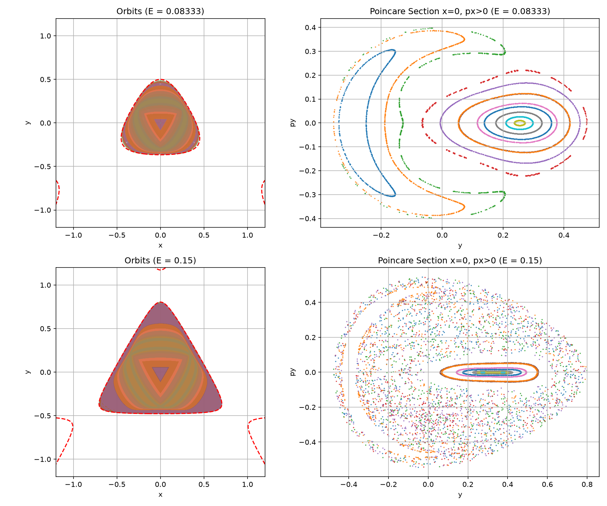

# Hénon-Heiles Galactic Orbit Simulation & Poincaré Sections

We have successfully formulated the Hénon-Heiles system, integrated it using CasADi's `cvodes` suite, and generated the orbit plots and Poincaré sections.

## Simulation Results

---

## Physical Analysis

### 1. Low Energy ($E = 0.08333 \approx 1/12$)
* **Orbits (Top-Left):** The trajectories are regular, bounded, and exhibit symmetry. They are confined well within the zero-velocity curve (red dashed line).
* **Poincaré Section (Top-Right):** Slicing the phase space at $x=0, p_x > 0$ yields neat, closed 1-dimensional curves. Each curve corresponds to a different initial vertical coordinate $y_0$. These closed curves are 2D slices of 3D invariant tori. This confirms that a **third integral of motion** is conserved, restricting the star's motion to a torus rather than letting it fill the entire 3D energy surface.

### 2. High Energy ($E = 0.15$)
* **Orbits (Bottom-Left):** The trajectories appear highly irregular and fill the space inside the zero-velocity curve.
* **Poincaré Section (Bottom-Right):** The concentric tori have mostly broken down. Instead of neat closed curves, we observe a scattered "sea" of points, representing **chaotic motion**. This indicates that the third integral of motion has been destroyed by the non-linear coupling. However, some smaller concentric loop structures ("stability islands") still persist, representing resonant regular orbits that resist chaos.

---

## Code Files
* **Lisp Generator Code:** [gen02.lisp](gen02.lisp)
* **Generated Python Code:** [p02_hh.py](p02_hh.py)
