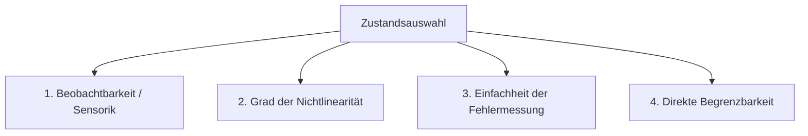

# Leitfaden zur Zustandsdefinition und Fehlerformulierung im MPC

In der Systemtheorie und der modellprädiktiven Regelung (MPC) ist die **Definition des Systemzustands ($\mathbf{x}$)** eine der wichtigsten Designentscheidungen. Sie beeinflusst direkt:
1. Wie komplex und nichtlinear die Systemgleichungen werden.
2. Wie einfach Regelungsfehler minimiert werden können.
3. Ob der Löser (Solver) schnell konvergiert oder stecken bleibt.

Dieses Dokument erklärt, wie man Zustände geschickt wählt, zwischen Koordinatensystemen wechselt und Fehlerzustände definiert.

---

## 1. Was macht eine gute Zustandsdefinition aus?

Ein Systemzustand $\mathbf{x}(t)$ muss die **historische Information des Systems minimal, aber vollständig** zusammenfassen, damit wir mit dem aktuellen Zustand und den zukünftigen Stellgrößen $\mathbf{u}$ die Zukunft vorhersagen können.

Bei der Auswahl der Zustände solltest du folgende Kriterien prüfen:



### Die vier Kernkriterien:
1.  **Beobachtbarkeit (Observability)**: Können wir die Zustände direkt messen oder über einen Zustandsschätzer (wie MHE oder Kalman-Filter) zuverlässig rekonstruieren? (Siehe das Beispiel [gen11h.lisp](file:///workspace/src/cl-py-generator/example/171_casadi/gen11h.lisp)).
2.  **Grad der Nichtlinearität**: Können wir die Zustände so definieren, dass die Systemgleichungen möglichst linear oder bilinear werden? (Z. B. Quaternionen statt Euler-Winkel bei Drohnen, um trigonometrische Funktionen und Singularitäten wie den Gimbal Lock zu vermeiden).
3.  **Fehlerdarstellung (Error Tracking)**: Wie einfach lässt sich die Abweichung zum Sollwert im Zustand ausdrücken?
4.  **Direkte Begrenzung (Constraints)**: Wenn wir physikalische Grenzen haben (z. B. maximale Gierrate, maximaler Federweg), sollten diese Größen direkt als Zustand definiert werden. Schranken für Zustandsvariablen (`lbx` / `ubx`) sind für Optimierungsalgorithmen extrem schnell zu verarbeiten, während komplexe funktionale Nebenbedingungen (`lbg` / `ubg`) Rechenzeit kosten.

---

## 2. Globale vs. Lokale/Relative Zustände (Das Fahrzeug-Beispiel)

Um den Unterschied zu verstehen, betrachten wir die Bewegung eines autonomen Fahrzeugs auf einer Straße.

```
Globale Koordinaten (Inertialsystem)       Lokale Koordinaten (Pfad-relativ / Frenet)
           Y                                              Referenzlinie (Straße)
           ^                                                  \        . (Fahrzeug)
           |    . (x,y)                                        \   d  /
           |   /                                                \----*
           |  /                                                  \   |
           +-------------> X                                      \--+---> s
```

### Variante A: Globale Koordinaten (Inertialrahmen)
*   **Zustand**: $\mathbf{x} = [x, y, \psi, v]^T$ (Globale X- und Y-Position, globaler Gierwinkel, Geschwindigkeit).
*   **Vorteil**: Sehr intuitiv für die absolute Routenplanung (GPS-Koordinaten).
*   **Nachteil**: Für die Spurführung ist diese Darstellung ungünstig. Wenn das Auto auf der Straße fährt, ändert sich die Referenz für $x_{ref}(t)$ und $y_{ref}(t)$ ständig. Die Dynamik $\dot{x} = v \cos(\psi)$ ist hochgradig nichtlinear und hängt stark von der absoluten Ausrichtung $\psi$ ab.

### Variante B: Lokale/Pfad-relative Koordinaten (Frenet-Rahmen)
Wir definieren den Zustand relativ zur Mittellinie der Straße:
*   **Zustand**: $\mathbf{x}_{local} = [s, d, \theta_{err}, v]^T$
    *   $s$: Zurückgelegte Wegstrecke entlang der Kurve (Longitudinaler Fortschritt) in Metern ($\text{m}$).
    *   $d$: Lateraler Abstand zur Mittellinie (Spurabweichung) in Metern ($\text{m}$).
    *   $\theta_{err}$: Abweichung des Fahrzeugwinkels vom Straßenkrümmungswinkel ($\psi - \psi_{road}(s)$) in Radiant ($\text{rad}$).
    *   $v$: Geschwindigkeit in $\text{m/s}$.
*   **Vorteil**: 
    *   Der Sollzustand für die Spurführung ist trivial konstant: $d_{ref} = 0$ und $\theta_{err, ref} = 0$.
    *   Wir können direkt Grenzen wie "Auto muss innerhalb der Fahrspur bleiben" formulieren: $-W_{spur}/2 \le d \le W_{spur}/2$. Dies ist eine einfache Grenzwertschranke für die Zustandsvariable (`lbx` / `ubx`), was extrem performant ist!
*   **Nachteil**: Die Transformation von globalen GPS-Koordinaten in den Frenet-Rahmen erfordert zusätzliche Projektionen (algebraische Gleichungen im Code).

---

## 3. Fehlerzustände (Error States) zur Linearisierung

Eine bewährte Methode in der modernen Regelungstechnik ist es, das System direkt in **Fehlerkoordinaten** zu formulieren.

Wenn wir eine Referenztrajektorie $\mathbf{x}_{ref}(t)$ und $\mathbf{u}_{ref}(t)$ haben, definieren wir den Fehlerzustand $\mathbf{e}(t)$ und die Stellgrößenabweichung $\delta\mathbf{u}(t)$:
$$\mathbf{e}(t) = \mathbf{x}(t) - \mathbf{x}_{ref}(t)$$
$$\delta\mathbf{u}(t) = \mathbf{u}(t) - \mathbf{u}_{ref}(t)$$

### Warum macht man das?
1.  **Linearisierung**: Für ein nichtlineares System $\dot{\mathbf{x}} = f(\mathbf{x}, \mathbf{u})$ können wir eine Taylor-Approximation erster Ordnung um die Referenzbahn herum durchführen. Das ergibt ein lineares, zeitvariantes System (LTV / Linear Time-Varying):
    $$\dot{\mathbf{e}}(t) \approx \mathbf{A}(t)\mathbf{e}(t) + \mathbf{B}(t)\delta\mathbf{u}(t)$$
    wobei:
    $$\mathbf{A}(t) = \left. \frac{\partial f}{\partial \mathbf{x}} \right|_{\mathbf{x}_{ref}, \mathbf{u}_{ref}}, \quad \mathbf{B}(t) = \left. \frac{\partial f}{\partial \mathbf{u}} \right|_{\mathbf{x}_{ref}, \mathbf{u}_{ref}}$$
2.  **Einfache Kostenfunktion**: Die Kostenfunktion wird im Fehlerzustand extrem sauber, da wir den Fehler direkt gegen Null regeln wollen:
    $$J = \sum_{k=0}^{N-1} \left( \mathbf{e}_k^T \mathbf{Q} \mathbf{e}_k + \delta\mathbf{u}_k^T \mathbf{R} \delta\mathbf{u}_k \right)$$

Diese Formulierung wird standardmäßig bei schnellen MPC-Lösern auf Mikrocontrollern eingesetzt (z. B. in der Luft- und Raumfahrt oder bei Robotern), da das resultierende zeitvariante QP (Quadratische Programmierung) um Größenordnungen schneller gelöst werden kann als das ursprüngliche nichtlineare NLP.

---

## 4. Systematik zur Auswahl der Zustandsformulierung

Wenn du vor einem neuen Problem stehst (z. B. einem Kran, einem chemischen Reaktor oder einer Drohne), gehe folgende Checkliste durch:

| Schritt | Frage | Maßnahme |
| :--- | :--- | :--- |
| **1** | Was sind meine physikalischen Grenzen (Sicherheit)? | Nimm diese Größen direkt in den Zustand auf (z. B. Drücke, Tankfüllstände, Gelenkwinkel), um einfache Box-Constraints zu nutzen. |
| **2** | Ändert sich der Sollwert ständig (Tracking) oder ist er fest (Regulierung)? | Bei ständigem Tracking: Nutze Pfad-relative (Frenet) Koordinaten oder Fehlerzustände. Bei fester Regulierung: Verwende physikalische Abweichungskoordinaten zum Arbeitspunkt. |
| **3** | Ist das System mechanisch gekoppelt (z. B. Roboterarm)? | Nutze generalisierte Koordinaten (Winkel $\theta_i$ und Winkelgeschwindigkeiten $\dot{\theta}_i$ der Gelenke) anstelle von kartesischen Koordinaten der Roboterhand, um die Zwangsbedingungen implizit in der Dynamik zu lösen. |
| **4** | Gibt es Ableitungen, die geregelt werden sollen? | Wenn z. B. die Beschleunigung oder der Ruck (Jerk) begrenzt sein müssen, erweitere den Zustand: Definiere die Beschleunigung als Zustand und den Ruck als neuen Steuereingang $\mathbf{u}$. |
