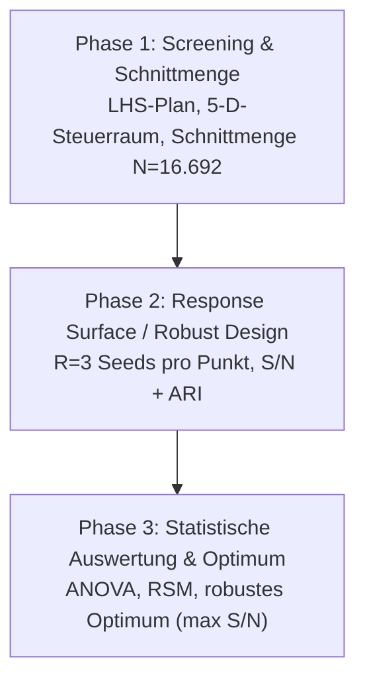
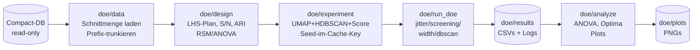

# Implementierungsplan: Robuste Cluster-Evaluation per Design of Experiments (DE)

Stand: 2026-09-27 · Code: `cl-py-generator/example/174_autocluster/doe/` ·
GPU: NVIDIA RTX A4000 (16 GB) · DB: `summaries_compact_20260924.db` (read-only)

## 0. Worum geht es (Einordnung für Mensch und Agent)

Die Vorgängeruntersuchung (`plan/20260924_01_cluster_search/`) fand per starrem
Grid-Sweep (5 × 2 × 2 Punkte, HDBSCAN-`min_cluster_size=15` fix) die
Best-Config `k=3072, d=12, nn=30, md=0.1` (adjustiert 0,1327, 167 Cluster).
Ein externes Review (`review.md` in diesem Ordner) bestätigt die Kernmethodik
(clustern in d-D, validieren im k-D-Originalraum), benennt aber vier
Schwachstellen und schlägt **Design of Experiments (DoE)** als robuste
Antwort vor. Dieser Plan setzt genau das um:

1. **Survival Bias beim Breitenvergleich** — bei k=3072 fielen 1.577 Rows weg,
   der Vergleich lief auf verschieden großen Teilmengen. Fix: alle Breiten auf
   der **Schnittmenge** (N=16.692 volle 3072-D-Rows).
2. **Scheingenauigkeit vs. `nn_descent`-Rauschen** — cuML-UMAP ist trotz fixem
   Seed nicht deterministisch; Differenzen ±0,002 zwischen d=8/12/16 können
   Messrauschen sein. Fix: **Replikation über Seeds** (Störgröße), Taguchi-S/N,
   ARI-Stabilität, ANOVA-Signifikanz.
3. **Unfairer HDBSCAN-vs.-DBSCAN-Vergleich** — DBSCAN lief mit geratener
   linearer eps-Heuristik. Fix: **faires eps-Grid pro Dimension**.
4. **Plotting-Bug** — 168-zeilige Matplotlib-Legende. Fix: Top-12 + Sammelpunkt.

## 1. DoE-Methodik (verbindlich)

Drei Phasen nach `review.md` Teil 3:



### 1.1 Faktorenraum

| Faktor | Typ | Stufen | Rolle |
|---|---|---|---|
| Schnittmenge | fix | nur volle 3072-D-Rows (N=16.692) | Kontrollvariable |
| Breite k | kategorial | [128, 768, 3072] | Untersuchungsfaktor (eigene Phase) |
| UMAP d | stetig (int) | [4, 20] | Steuergröße |
| UMAP n_neighbors | stetig (int) | [15, 60] | Steuergröße |
| UMAP min_dist | stetig | [0,0, 0,25] | Steuergröße |
| HDBSCAN min_cluster_size | stetig (int) | [10, 40] | Steuergröße (neu!) |
| HDBSCAN min_samples | stetig (int) | [5, 25] | Steuergröße (neu!) |
| Seed / GPU-Jitter | diskret | [42, 1337, 2026] (+7, 99 …) | **Störgröße** |

Versuchsplan: **Latin Hypercube Sampling** (`scipy.stats.qmc`, 60 Punkte
Screening + 12 Punkte Breiten-Ablation), je Punkt R=3 Seed-Replikate
(Jitter-Phase: R=10 auf der Best-Config).

### 1.2 Zielmetriken pro Design-Punkt

1. **Mean Adjusted Silhouette** `mean_adj` (Mittel über Seeds).
2. **Taguchi-S/N „larger-is-better"** `η = −10·log₁₀(mean(1/s²))` —
   robustes Optimum = max S/N, nicht max Peak.
3. **Cluster-Stabilität** = mittlerer paarweiser **ARI** über Seeds
   (Noise −1 als eigene Kategorie).
4. **ANOVA (Typ II)** + **Response-Surface-Regression** (quadratisch +
   2-Wege-Interaktionen) via `statsmodels`: Welcher Faktor erklärt die
   Varianz signifikant (p < 0,05)?

### 1.3 Akzeptanzkriterien (aus Vorgängeruntersuchung übernommen)

Noise ≤ 40 %, n_clusters ≥ 2, sonst Run verworfen; Design-Punkt braucht
≥ 2 akzeptierte Replikate. Scoring stets im **k-dim Originalraum**
(L2-normiert ≙ Kosinus): `Score = Silhouette_orig × (1 − NoiseRatio)`.

## 2. Architektur



Module (reines Python, kein Lisp-Transpiler; GPU-Imports lokal):

| Datei | Zweck |
|---|---|
| `doe/data.py` | Schnittmenge einmal auf 3072 laden, pro k Prefix + L2-Norm (`truncate_norm`, `load_aligned`) |
| `doe/design.py` | `PARAM_BOUNDS`, `SEEDS`, `generate_lhs_design` (vektorisiert via `qmc.scale`), `taguchi_sn`, `pairwise_ari`, `aggregate_point`, `fit_response_surface` |
| `doe/experiment.py` | `run_one` (UMAP+HDBSCAN+Score, Cache-Key inkl. Seed), `run_dbscan_eps` für eps-Grid |
| `doe/run_doe.py` | CLI `--phase jitter\|screening\|width\|dbscan\|all`, schreibt `doe/results/*.csv` |
| `doe/analyze.py` | ANOVA/RSM-Bericht + Plots (`doe_jitter_hist`, `doe_screening_effects`, `doe_stability`, `doe_width`, `doe_dbscan`) |
| `tests/test_doe.py` | CPU-Tests: LHS-Bounds/Reproduzierbarkeit, Taguchi (Jensen), ARI, Trunkierung, RSM-Synthetic |
| `plot_final.py` (Fix) | Legende: Top-12-Cluster + Sammelpunkt statt 168 Einträgen |

Verifizierte API-Fakten (DeepWiki, neueste Versionen — Details in `deps.md`):

```python
from scipy.stats import qmc
sampler = qmc.LatinHypercube(d=5, rng=42)   # rng = Seed (reproduzierbar)
scaled = qmc.scale(sampler.random(n=60), lo, hi)  # vektorisierte Bounds
```

```python
from statsmodels.formula.api import ols
from statsmodels.stats.anova import anova_lm
model = ols("mean_adj ~ (d + n_neighbors + min_dist + min_cluster_size"
            " + min_samples)**2 + I(d**2) + I(n_neighbors**2)", data=df).fit()
anova_lm(model, typ=2)  # Typ II bei Interaktionen
```

```python
from cuml.cluster import HDBSCAN  # min_samples default None → = min_cluster_size
HDBSCAN(min_cluster_size=15, min_samples=10).fit_predict(X_red)
```

## 3. Requirements-Lücken und Vorschläge (Review des Auftrags)

Der Auftrag (`prompt.txt` + `review.md`) ist ungewöhnlich vollständig. Folgende
Punkte waren **nicht** gefordert, sind aber umgesetzt bzw. vorgeschlagen:

| # | Punkt | Status |
|---|---|---|
| 1 | Jitter-Quantifizierung mit R=10 statt R=3 auf Best-Config | ✅ umgesetzt (härtere Statistik, billig) |
| 2 | 60 statt 40–50 Screening-Punkte (Runs sind ~Sekunden) | ✅ umgesetzt |
| 3 | DBSCAN-eps-Grid als eigene Phase (statt nur HDBSCAN-DoE) | ✅ umgesetzt |
| 4 | `plot_final.py`-Legendenfix | ✅ umgesetzt |
| 5 | Trustworthiness-Elbow / TwoNN / PCA (offen aus Vorgängerplan) | ⚠️ weiter offen — Manifold-Fidelity, orthogonal zum DoE |
| 6 | ARI über Seeds für DBSCAN-Phase | ❌ bewusst weggelassen (1 Seed, eps-Vergleich steht im Fokus) |
| 7 | Sobol-Sequenz statt LHS | ❌ LHS genügt; Sobol als Follow-up bei >100 Punkten |
| 8 | Box-Behnken/CCD als konfirmatorisches Design ums Optimum | 💡 Vorschlag: 2. DoE-Runde um robustes Optimum (RSM-Verfeinerung) |
| 9 | `brute_force_knn`-Kontrollläufe für Bit-Reproduzierbarkeit | 💡 Vorschlag: 3 Punkte × 2 Seeds als Determinismus-Anker |
| 10 | Online-Update/Rust-Einordner (auskommentiert in `collect.sh`) | 💡 Vorschlag: eigenes Folgeprojekt (Cluster-Zuordnung neuer Embeddings ohne GPU) |

## 4. Datei-Leseliste für den Implementierungsagenten

| Datei | Warum lesen |
|---|---|
| `plan/20260927_01_review_doe/prompt.txt` | Originalauftrag (DoE-Untersuchung, GPU, Statistik) |
| `plan/20260927_01_review_doe/review.md` | Review mit DoE-Spezifikation (Faktoren, Metriken, Code-Skizze) |
| `plan/20260927_01_review_doe/deps.md` | Dependency-Pfade + DeepWiki-Abfragen |
| `plan/20260927_01_review_doe/task.md` | Serielle Tasks mit Validierung |
| `untersuchung_technisch_de.md` | Technischer Bericht der Vorgängeruntersuchung (Zahlen, Methode) |
| `loader.py` | BLOB-Dekodierung, Matryoshka-Trunkierung (Bias-Ursache Z. 49–51) |
| `sweep_umap.py` | `run_umap`, `adjusted_score`, `label_stats` (wiederverwendet) |
| `cluster_search.py` | `cluster_hdbscan`-Signatur (nur mcs — DoE braucht zusätzlich ms) |
| `validate.py` | `score_config`-Kriterium (unverändert übernommen) |
| `plot_final.py` | Legenden-Bug (Z. 50–53, vor Fix) |
| `ENV.md` | GPU-Env (`.venv` per `uv`, NVIDIA-Wheels) |
| DeepWiki `scipy/scipy` | `qmc.LatinHypercube` + `qmc.scale` (Vektor-Skalierung!) |
| DeepWiki `statsmodels/statsmodels` | `ols`-Formeln (`I(x**2)`, `x:y`), `anova_lm(typ=2)` |
| DeepWiki `rapidsai/cuml` | HDBSCAN `min_samples`-Semantik, `nn_descent`-Nichtdeterminismus |

`rs-summarizer`-Quellen bleiben **read-only** (keine Edits dort).

## 5. Tests & Commit-Konvention

- **Unit/Host-Tests** (`tests/test_doe.py`, CPU-only, keine GPU nötig):
  LHS-Bounds/Typen/Reproduzierbarkeit, Taguchi-Präferenz (Jensen-Ungleichung
  bei gleichem Mittelwert), ARI=1 bei identischen Labels, Prefix-Trunkierung +
  Einheitsnorm, `aggregate_point`-Mindest­replikate, RSM-Fit auf synthetischen
  Daten. Laufen per `pytest tests/` im Projekt-`.venv`.
- **GPU-Validierung**: keine automatisierten GPU-Tests (Hardware-Pflicht);
  stattdessen Phasen-Smoke (`--phase dbscan`, schnell) + CSV-Vollständigkeit
  (alle Punkte × Seeds vorhanden) + Plausibilitäts­schranken (Jitter-std klein,
  ARI ∈ [0,1], ANOVA-p-Werte vorhanden).
- **Commits**: Conventional Commits mit umfassendem Body (Was/Warum/Validierung),
  ein logischer Change pro Commit, erst nach grünen Tests committen.
  Typen: `feat(doe): …`, `fix(plot): …`, `test(doe): …`, `docs(doe): …`.
  Beispiel:
  ```text
  feat(doe): LHS-Screening mit Seed-Replikaten und S/N-Aggregation

  - doe/design.py: generate_lhs_design (qmc, vektorisiert), taguchi_sn, ...
  - Warum: Review §3 fordert Replikation über Störgröße + robustes Optimum
  - Validierung: pytest tests/test_doe.py (10 Tests grün), R=3 Smoke auf GPU
  ```
