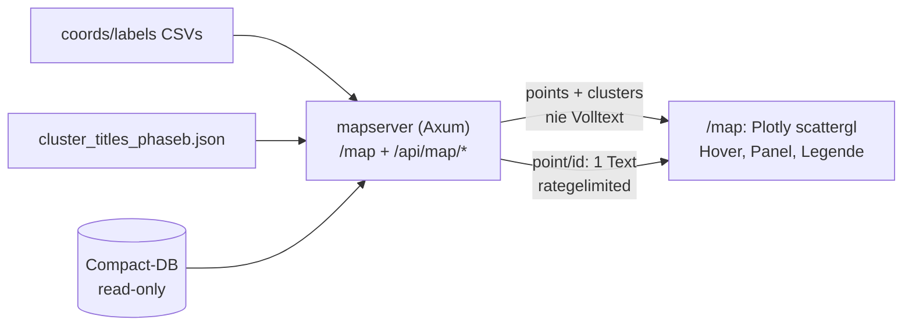

# Implementierungsplan: Standalone-Kartenvalidierung per Rust-Axum (DE)

Stand: 2026-09-27 · Code: `cl-py-generator/example/174_autocluster/mapserver/` (neu) ·
Referenz (read-only!): `/workspace/src/rs-summarizer` · DB: `summaries_compact_20260924.db` (read-only)

## 0. Worum geht es (Einordnung für Mensch und Agent)

Das Clustering ist wissenschaftlich abgeschlossen (DoE Runde 1+2, HDBSCAN mcs=11/ms=8
auf UMAP d=11, 219 Cluster + Noise, N=16.692). Als Artefakt existiert eine statische
Plotly-Karte (`plots/clusters.html`, 9 MB, gitignoriert): Noise-Punkte haben keine Infos,
kein Punkt ist anklickbar. Dieser Plan baut ein KLEINES, SELBST-GEHOSTETES Rust-Programm
(`mapserver/`), das standalone validiert: Hover für alle Punkte inkl. Noise, Klick-Panel
mit Volltext + Link, Legende mit Filtern, Zoom/Pan, Herkunfts-Fußzeile.

VERBINDLICH (User, 2026-09-27): `rs-summarizer` wird NICHT geändert. Keine Server-/
nginx-Arbeit — nur ein nginx-Vorschlag als Datei. Die spätere Übernahme nach
rs-summarizer ist out of scope (nur Einschätzung im Walkthrough).

## 1. Kontext für den Agenten (Pflicht-Leseliste)

Referenz `rs-summarizer` (Stil-/Architektur-Vorbild, NIE schreiben):

- `src/main.rs` — Serve-Muster: `HOST`/`PORT`-ENV (Default 5001), `axum::serve` mit
  `into_make_service_with_connect_info`, graceful shutdown, `tracing`-Logging.
- `src/lib.rs` — `build_router(state)`: Routen-Tabelle + `nest_service("/static", ServeDir)`.
- `src/routes/mod.rs` — Handler-Muster (`State`, `Path`, `ConnectInfo`, `Html`), inkl.
  `extract_client_ip` (X-Forwarded-For/X-Real-IP, für nginx-Betrieb relevant).
- `src/db.rs` — DB-Muster (Referenz nutzt `sqlx`; mapserver nutzt bewusst `rusqlite`, s. D2).
- `src/templates.rs` + `templates/index.html` — Askama-Structs + pico/htmx-Look.
- `static/` — vendored `pico.min.css` v2.0.6 (MIT) + `htmx.min.js` (Referenz, nicht kopieren).
- `Cargo.toml` — Versionsanker: axum 0.8.9, tokio full, tower-http fs, askama 0.16.
- DeepWiki `plops/rs-summarizer`, Kap. 3 (Web Layer) — Q&A zu Router/Askama/ServeDir.

174_autocluster-Artefakte:

- `plan/nginx.conf` — Referenz: `/` → 127.0.0.1:5001, gzip aktiv, `/exports/`-Alias.
- `plan/20260927_01_review_doe/walkthrough.md`, Abschnitt 8 — Methodik (Fußzeilen-Quelle).
- `doe/TITLING_de.md` — Store-Format `cluster_titles_phaseb.json` (nur `title`+`n` nutzen!).
- `doe/PHASEB_de.md` — Methoden-Entscheid (HDBSCAN-Parameter für Fußzeile).
- `ENV.md` — DB-Regeln: **stets read-only öffnen** (`mode=ro`-Äquivalent).
- `plots/coords_phaseb_2d.csv`, `plots/labels_phaseb.csv` — je 16.692+Header. ACHTUNG
  Macke: Header kommagetrennt, Zeilen **leerzeichengetrennt** (per `od` verifiziert) →
  tolerant auf Komma/Whitespace splitten (D4). 219 Cluster (0..218) + Noise −1 (5.996).
- `summaries_compact_20260924.db` — Tabelle `summaries`, Spalten `summary`,
  `original_source_link`. Alle 16.692 IDs vorhanden; 3.882 leere Summaries, 595 leere
  Links im gemappten Set → Fallback-Texte einplanen.

## 2. Architektur

| Route | Ausgabe | Schutz |
|---|---|---|
| `GET /map` | Askama-HTML-Shell (Div, Panel, Legende, Fußzeile) | enthält nie Volltext (Test!) |
| `GET /api/map/points` | 16.692 × (identifier,x,y,cluster) | Keys-Whitelist-Test |
| `GET /api/map/clusters` | 219 × (id,Titel,Größe) + Noise-Zeile | dto. |
| `GET /api/map/point/{id}` | 1× (Volltext, Link, Titel, Identifier) | Rate-Limit 60/min/IP, 404 bei unbekannt |
| `GET /healthz` | `{"status":"ok","points":N,"clusters":M}` | — |

ENV (alle mit Default): `HOST` (127.0.0.1), `PORT` (8080), `MAP_DB`,
`MAP_COORDS`, `MAP_LABELS`, `MAP_TITLES`, `MAP_DETAIL_PER_MIN` (60).

## 3. Entscheidungen (D1–D8, begründet)

- **D1 Eigenes Binary; Referenz read-only.** Vorgabe des Users. Muster aus Referenz
  übernommen (ENV-Ports, `build_router`-Funktion für Testbarkeit, Askama, tracing).
- **D2 `rusqlite` + `OpenFlags::SQLITE_OPEN_READ_ONLY`, Zugriff via `spawn_blocking`**
  (pro Request frische Connection — bei 60/min/IP billig genug, kein Pool nötig).
  `sqlx`-Alternative trotz Referenz-Präzedenz verworfen (schwerer, unnötig).
  Usage: `Connection::open_with_flags(path, OpenFlags::SQLITE_OPEN_READ_ONLY)` +
  `SELECT summary, original_source_link FROM summaries WHERE identifier = ?`.
- **D3 `tower_governor` 0.8.0 nur auf Detail-Route.** Usage (docs.rs):
  `GovernorConfigBuilder::default().per_second(1).burst_size(60).finish()`,
  `.route("/api/map/point/{id}", …).layer(GovernorLayer::new(conf))`
  (Test: `burst_size(2)` + 3 schnelle Requests → 3. ist 429).
  Mapping: burst = per_min, rate = max(1, per_min/60)/s. Default-Key = Peer-IP:
  lokal korrekt; hinter nginx teilen sich alle Clients einen Bucket, bis der
  Key-Extractor auf X-Forwarded-For umgestellt wird (Übernahme-Notiz!).
- **D4 CSV manuell parsen** (Macke s.o.), kein `csv`-Crate: Header skippen, Zeilen auf
  Komma/Whitespace splitten, Counts validieren (16.692, ID-Mengen identisch).
- **D5 Plotly `scattergl` via CDN (MIT), Pin per curl verifizieren**, Byte-Größe
  dokumentieren. Präzedenz: `plots/clusters.html` rendert dieselben Punkte mit
  scattergl. Ein Trace pro Cluster (219) + Noise-Trace → Legenden-Toggle gratis.
  Tests netzfrei (nur APIs + Shell).
- **D6 Askama für `/map`** (ein Template; Provenienz N/Methode/Datum serverseitig).
  Minimal-Usage wie Referenz: `#[derive(Template)] #[template(path = "map.html")]`.
- **D7 Kein htmx** für Karten-Events (`fetch` genügt); Stil an pico-Klassen angelehnt.
- **D8 Mitgebaut:** `/healthz`, `tracing`-Logging, `Cache-Control` für Punkte-API
  (statische Daten), A11y-Minimum (Panel fokussierbar, per Button/Esc schließbar,
  responsives Layout). Nur bei Zeit: Deep-Links, Titelsuche, Config-Datei.
  Methodik-„Link" = In-Page-Anker auf Fußzeilen-`
` (keine geratenen URLs!).

## 4. Anti-Scraping-Design (verbindlich)

Weder Seite noch Bulk-APIs enthalten je Volltext — auch keine Hover-Excerpts
(16.692 × 220 Zeichen wäre das Korpus). Genau ein Text pro Detail-Call,
rategelimited. Tests beweisen: Keys-Whitelist auf Bulk-JSON, Snippet-Abwesenheit
im HTML, 429-Nachweis, „max ein Summary-Text pro Response".

## 5. Teststrategie

- Unit (in `src/`): CSV-Quirk, Titel/Label-Konsistenz (219, IDs 0..218, Noise 5.996),
  Quota-Mapping.
- Integration (`tests/`, Fixtures in tempdir: Mini-CSVs/JSON + per `rusqlite`
  erzeugte Mini-DB): Route 200 + Karten-Div; 16.692-Punkte-Äquivalenz auf Fixture +
  Keys-Whitelist; Detail 200 (Volltext+Link) / 404; 429 bei niedrigem Limit;
  Cluster-Counts. Live-Server auf 127.0.0.1:0 + rohe HTTP-Requests über `TcpStream`
  (keine extra HTTP-Client-Dep; `ConnectInfo` für Governor vorhanden).
- Abnahme: `cargo test`, curl-Smoke (s. `task.md`), Performance (`curl -w`:
  Punkte < 0,5 s, Seite < 2 s), Browser-Protokoll.

## 6. Commit-Konvention

Conventional Commits (`feat(mapserver): …`, `test(mapserver): …`, `docs(map): …`)
mit umfassender Beschreibung (Was/Warum/Validierung). 5 Commits: Gerüst → Daten →
API → UI → Abnahme/Walkthrough. Nie `plots/clusters.html` oder `target/` committen.

## 7. Risiken

CDN offline (nur manuelles Rendering betroffen, Tests netzfrei); `sqlite3`-CLI fehlt
(DB-Checks via `python3`); Peer-IP-Limit hinter nginx (nur Übernahme-Notiz);
leere Summaries/Links (Fallback-Texte, per DB-Count belegt).
