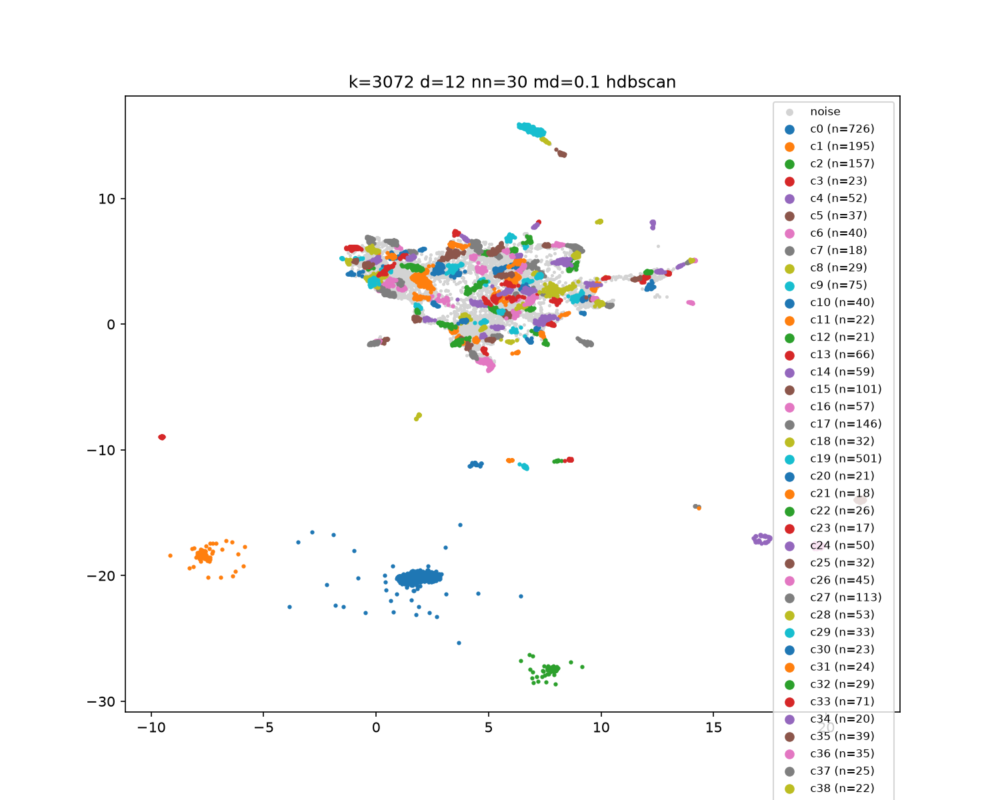

# Technische Untersuchung: cuML-UMAP-Cluster-Suche über YouTube-Summary-Embeddings

Stand: 2026-09-24 · Code: `example/174_autocluster` · GPU: NVIDIA RTX A4000 (16 GB)

## 1. Ziel & Fragestellung

Für ~20.000 Video-Summary-Embeddings (Google-Matryoshka-Format, bis 3072 float32)
sollte per GPU-beschleunigter Parametersuche (cuML-UMAP) die Config gefunden werden,
die die besten Cluster liefert. Kernfragen:

1. Welche UMAP-Parameter (`n_components`, `n_neighbors`, `min_dist`) + Clusterer
   (DBSCAN vs. HDBSCAN) liefern die besten Cluster?
2. Liefern volle 3072 Dimensionen einen messbaren Benefit gegenüber dem 768er-Prefix?
3. Output: 2D-Diagramm(e) der besten Cluster.

## 2. Datengrundlage

Zwei Quellen, beide read-only genutzt:

| DB | Rows | 768-D | 3072-D | NULL | nutzbar k=128 | nutzbar k=3072 |
|---|---|---|---|---|---|---|
| Live (`summaries.db`, `summary_done=1`) | 14.355 | 1.577 | 12.569 | 209 | 14.146 | 12.569 |
| Compact (`summaries_compact_20260924.db`) | 19.293 | 1.577 | 16.692 | 1.024 | 18.269 | 16.692 |

BLOB-Format: little-endian float32 (`viz-tool/src/embedding.rs`,
Referenz, read-only). Matryoshka-Semantik: kürzere Vektoren sind ein Prefix der
längeren — Trunkierung auf Breite k nimmt die ersten k Floats. Null-/Zero-Norm-
Vektoren werden gefiltert. Alle Sweeps liefen auf der Live-DB, danach identisches
Grid als Re-Sweep auf der Compact-DB (Live-Ergebnisse: `archive_livedb_20260924/`).

## 3. Methode

**Kardinalregel:** Clustern im reduzierten d-D-Raum, **bewerten im originalen
hochdimensionalen Raum** (L2-normalisiert ≙ Kosinus-Distanz). Silhouette im
reduzierten Raum wäre über Dimensionen hinweg unvergleichbar und durch
`min_dist=0.0`-Kollaps künstlich aufgebläht.

**Kriterium:** `Score = Silhouette_orig × (1 − NoiseRatio)`, Noise (`-1`)
vorher filtern; Configs mit Noise > 40 % oder < 2 Clustern verworfen.

**Suchraum:** Breiten k ∈ {128, 768, 3072} · d ∈ {2, 4, 8, 12, 16, 24} ·
`n_neighbors` ∈ {15, 30} · `min_dist` ∈ {0.0, 0.1} · `metric='cosine'`,
`build_algo='nn_descent'`, Seed fix. DBSCAN mit eps-Skala `0.3 + d·0.02`,
`min_samples=15`; HDBSCAN `min_cluster_size=15`. d=2 nur für Final-Plots
(Density-Trap: ab d≥25 bricht dichtebasiertes Clustern zusammen).

## 4. Pipeline & Reproduzierbarkeit

`loader.py` (DB → float32 + L2-Norm) → `sweep_umap.py` (Grid, `.npy`-Cache,
~1 s/Config) → `cluster_search.py` → `validate.py` (Orig-Raum-Scoring) →
`ablation_width.py` → `plot_final.py`. DB per `--db` wählbar.

Env (`.venv`, Pins in `requirements.txt`/`ENV.md`): `cuml-cu12==26.08.00`,
`cupy-cuda12x==14.2.0` (nvidia-PyPI), `numpy==2.4.6`, `scikit-learn==1.9.1` u. a.
Tests: 14/14 grün (Loader-Roundtrip, Live-+Compact-Counts, Score-Formel).
Einschränkung: `nn_descent` ist trotz `random_state` **nicht deterministisch**
(Refit: 178 statt 167 Cluster) — für bitgenaue Runs `brute_force_knn`.

## 5. Ergebnisse (Compact-DB, 120/120 Configs akzeptiert)

| k | beste Config | Cluster | Noise | sil_orig | adjustiert |
|---|---|---|---|---|---|
| 128 | d16 nn15 md0.1 | 179 | 35,4 % | 0,1889 | 0,1220 |
| 768 | d08 nn15 md0.0 | 226 | 30,8 % | 0,1833 | 0,1269 |
| 3072 | d12 nn30 md0.1 | 167 | 36,5 % | 0,2091 | 0,1327 |

**Sieger** (`best_params_compact.json`): k=3072, UMAP d=12 / nn=30 / md=0.1,
HDBSCAN mcs=15. HDBSCAN dominiert DBSCAN auf dem gesamten Grid (adj ~0,12 vs.
~0,04); die Antwort über d ∈ [4, 16] ist flach (±0,002), d=2 versagt wie
vorhergesagt. Live-DB-Reihenfolge identisch (0,1092 / 0,1179 / 0,1240).

**Ablations-Fazit:** 3072 > 768 > 128 — volle Breite bringt +4,6 % gegenüber 768
und +8,8 % gegenüber 128 (adjustiert), bei 11 % verworfenen Kurz-Rows.

Cluster-Labels pro Video: `plots/labels.csv` (`identifier → cluster`).

## 6. Learnings & offene Punkte

- Der 128er-Pilot reihte die Methoden korrekt (HDBSCAN ≫ DBSCAN), unterschätzte
  aber absolute Qualität — Pilot für Tempo, Entscheidung auf voller Breite.
- `viz-tool` (Rust/CPU) clustert in 2D/4D mit O(n²)-DBSCAN — genau der eingangs
  kritisierte Anti-Pattern; BLOB-/Label-Konventionen (`-1` = Noise) übernommen.
- DBSCAN-eps-Basis gehört neu kalibriert, falls DBSCAN bleiben soll.
- Offen: ARI-Seed-Stabilität, Trustworthiness-Elbow, TwoNN/PCA-Intrinsik-Plots.

## 7. Anhang

Details: `plan/20260924_01_cluster_search/{plan,task,ablation}.md`,
`walkthrough.md`; Tabellen: `results_pilot_compact.csv`, `results_width*.csv`;
Docker-Pakete: siehe `ENV.md`.
